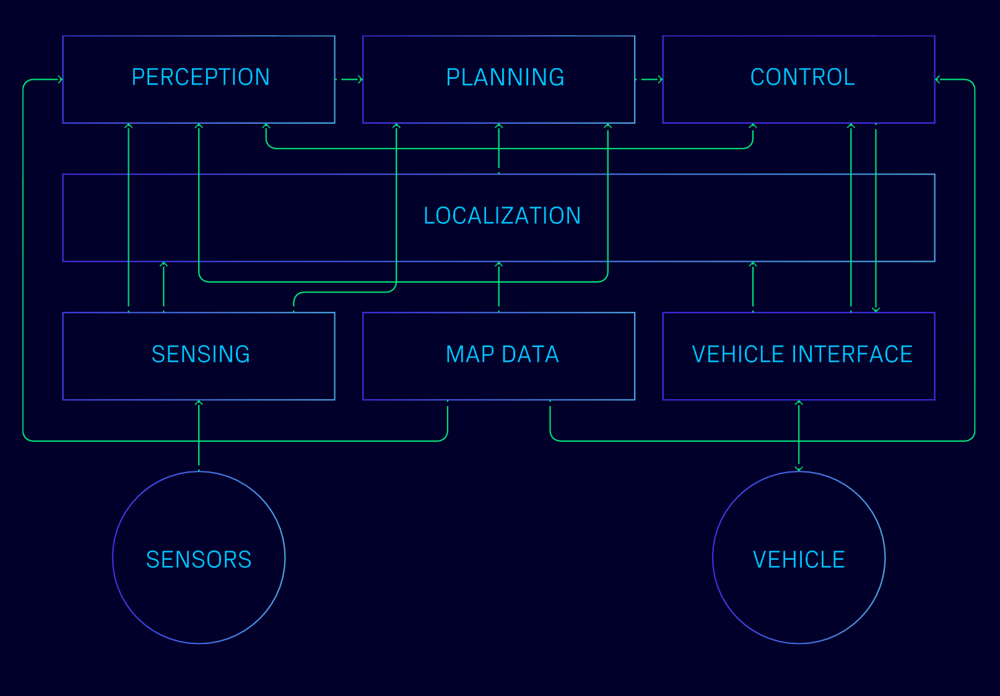

# Open AD Kit

## Containerized Components for Autoware

Open AD Kit is a collaborative project developed by the Autoware Foundation and its member companies and alliance partners. It aims to bring software-defined best practices to the Autoware project and to enhance the Autoware ecosystem and capabilities by partnering with other organizations that share the goal of creating software-defined vehicles.

Open AD Kit packages [Autoware](https://github.com/autowarefoundation/autoware) as a set of focused, independently deployable container images: Autoware provides the autonomy stack; Open AD Kit makes it deployable. It lowers the threshold for deploying Autoware across cloud and edge with composable images, ready-to-run deployment configurations, and a modernized CI/CD approach.

## The First SOAFEE Blueprint

The Autoware Foundation is a voting member of the [SOAFEE (Scalable Open Architecture For the Embedded Edge)](https://soafee.io/) initiative, and the Autoware Open AD Kit is the first SOAFEE blueprint for the software-defined vehicle ecosystem.

### Quick Links

- **[Getting Started](https://autowarefoundation.github.io/openadkit/getting-started/)**
- **[Documentation](https://autowarefoundation.github.io/openadkit/)**
- **[Supported Platforms](https://autowarefoundation.github.io/openadkit/platforms/)** — Hardware and platform support status
- **[Development](https://autowarefoundation.github.io/openadkit/development/)** — Build from source and contribute

## Container Image Tags

Open AD Kit publishes build-specific, release, latest-stable, and CI development image tags to GitHub Container Registry. See the canonical **[Container Image Tags](https://autowarefoundation.github.io/openadkit/getting-started/image-tags/)** page for the full tag taxonomy, examples, and pinning guidance. Use stable release tags for fully pinned deployments; sample compose files use default ROS distro aliases for convenience. CUDA image aliases are amd64-only.

## Release Flow

Maintainers promote an existing build instead of rebuilding during release. See the canonical **[Release Flow](https://autowarefoundation.github.io/openadkit/getting-started/release-flow/)** page for the current step list and validation gates. The build metadata, scan metadata, and `.github/image-inventory.json` are the source of truth for release validation.

## Key Features

### Modular Components

Open AD Kit is a microservice-based project designed to run on a variety of platforms. Each component is independent and can be deployed independently.

- **Independent images** for sensing, perception, mapping, localization, planning, control, APIs, simulation, and visualization
- **Multi-platform deployment** supporting both amd64 and arm64 architectures
- **Configurable ROS 2 container deployments** with environment-driven composition

### Mixed Criticality

Open AD Kit supports mixed-criticality deployment, separating components by criticality assumption. This architecture allows flexible deployment strategies where higher-criticality driving functions can run on safety-qualified hardware while monitoring and development components operate on standard platforms.

- **Flexible deployment** separating components by criticality assumption
- **Configurable criticality** across development, testing, and vehicle deployment scenarios
- **Hardware abstraction** supporting safety-island compute architectures

### Cloud Native

Open AD Kit leverages modern cloud-native technologies to deliver a scalable, portable AD stack.

- **Seamless scaling** from development laptops to in-vehicle edge devices
- **Hybrid cloud support** bridging development and deployment environments
- **Containerized runtimes** using Docker Compose, Docker Bake, and platform-specific integrations such as AutoSD

### Connected and Continuous

Open AD Kit works toward an always-connected deployment lifecycle for autonomous driving — building, deploying, testing, observing, and updating modular Autoware deployments from the cloud to the edge.

- **Automated CI/CD** with GitHub Actions integration
- **Optimized build caching** for faster deployment cycles
- **Continuous testing** in containerized environments

## Building images locally

Open AD Kit images are built with `docker buildx bake`, driven by
[`components/docker-bake.hcl`](components/docker-bake.hcl). The component
images sit on top of upstream Autoware base images published to
`ghcr.io/autowarefoundation/autoware`.

See [Build from Source](https://autowarefoundation.github.io/openadkit/development/build-from-source/)
for the canonical local build workflow, including the Autoware source checkout
that component Dockerfiles bind-mount during `docker buildx bake`.
