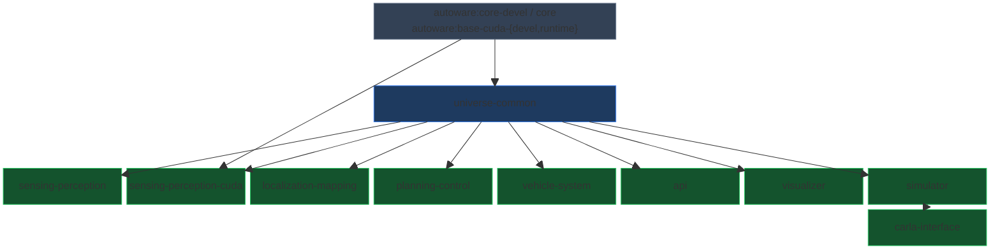

# Open AD Kit Components

This directory contains scripts and configurations to build Open AD Kit container images.

## Documentation

For **complete component documentation**, architecture overview, and visualizer settings, see the [Open AD Kit Components Documentation](https://autowarefoundation.github.io/openadkit/components/).

## Build Pipeline

```mermaid
block-beta
    columns 8

    space:3 UP["autoware:core-devel / core<br/>autoware:base-cuda-{devel,runtime}"]:2 space:3

    space:8

    space:3 UC["universe-common"]:2 space:3

    space:8

    SP["sensing-perception"] SPC["sensing-perception-cuda"] LM["localization-mapping"] PC["planning-control"] VS["vehicle-system"] API["api"] VIZ["visualizer"] SIM["simulator"]
    space:7 CARLA["carla-interface"]

    UP --> UC
    UC --> SP
    UC --> LM
    UC --> PC
    UC --> VS
    UC --> API
    UC --> VIZ
    UC --> SIM
    SIM --> CARLA
    UP --> SPC
    UC --> SPC

    style UP fill:#334155,stroke:#64748b,color:#e2e8f0
    style UC fill:#1e3a5f,stroke:#3b82f6,color:#bfdbfe
    style SP fill:#14532d,stroke:#22c55e,color:#bbf7d0
    style SPC fill:#14532d,stroke:#22c55e,color:#bbf7d0
    style LM fill:#14532d,stroke:#22c55e,color:#bbf7d0
    style PC fill:#14532d,stroke:#22c55e,color:#bbf7d0
    style VS fill:#14532d,stroke:#22c55e,color:#bbf7d0
    style API fill:#14532d,stroke:#22c55e,color:#bbf7d0
    style VIZ fill:#14532d,stroke:#22c55e,color:#bbf7d0
    style SIM fill:#14532d,stroke:#22c55e,color:#bbf7d0
    style CARLA fill:#14532d,stroke:#22c55e,color:#bbf7d0
```

Images are built with `docker buildx bake` from
[`components/docker-bake.hcl`](docker-bake.hcl). The `universe-common`
layer is an openadkit-owned thin intermediate that compiles the
universe-common slice of Autoware on top of upstream `core-devel`/`core`.

### Bake groups

| Group | Description | Targets |
|-------|-------------|---------|
| `universe-common` | Thin intermediate layer | `universe-common-devel`, `universe-common` |
| `component` | Component images (incl. CUDA) | `sensing-perception`, `sensing-perception-cuda`, `localization-mapping`, `planning-control`, `vehicle-system`, `api`, `visualizer`, `simulator`, `carla-interface` |

See the [components documentation](https://autowarefoundation.github.io/openadkit/components/)
for build commands and the CI pipeline.

## Related

- [Open AD Kit Deployments](https://autowarefoundation.github.io/openadkit/deployment/)
- [Getting Started](https://autowarefoundation.github.io/openadkit/getting-started/)
