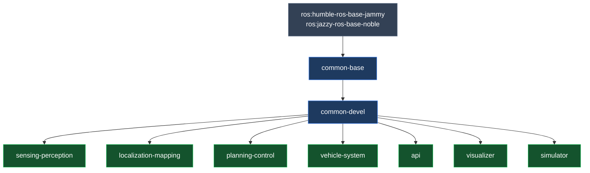

# Open AD Kit Components

This directory contains scripts and configurations to build Open AD Kit container images.

## Documentation

For **complete component documentation**, architecture overview, and visualizer settings, see the [Open AD Kit Components Documentation](https://autowarefoundation.github.io/openadkit/components/).

## Build Pipeline

```mermaid
flowchart TB
    ROS["ros:humble-ros-base-jammy<br/>ros:jazzy-ros-base-noble"]:::rosBase --> CB["common-base"]:::commonBase
    CB --> CD["common-devel"]:::commonBase

    CD --> SP["sensing-perception"]:::componentImage
    CD --> LM["localization-mapping"]:::componentImage
    CD --> PC["planning-control"]:::componentImage
    CD --> VS["vehicle-system"]:::componentImage
    CD --> API["api"]:::componentImage
    CD --> VIZ["visualizer"]:::componentImage
    CD --> SIM["simulator"]:::componentImage

    classDef rosBase fill:#334155,stroke:#64748b,color:#fff
    classDef commonBase fill:#1e3a5f,stroke:#3b82f6,color:#fff
    classDef componentImage fill:#14532d,stroke:#22c55e,color:#fff
```

### Build Groups

| Group | Description | Targets |
|-------|-------------|---------|
| `common` | Common images | base, devel, base-cuda, devel-cuda |
| `component` | Component images | sensing-perception, sensing-perception-cuda, localization-mapping, planning-control, vehicle-system, api, visualizer, simulator |

## Related

- [Open AD Kit Deployments](https://autowarefoundation.github.io/openadkit/deployments/)
- [Getting Started](https://autowarefoundation.github.io/openadkit/getting-started/)
