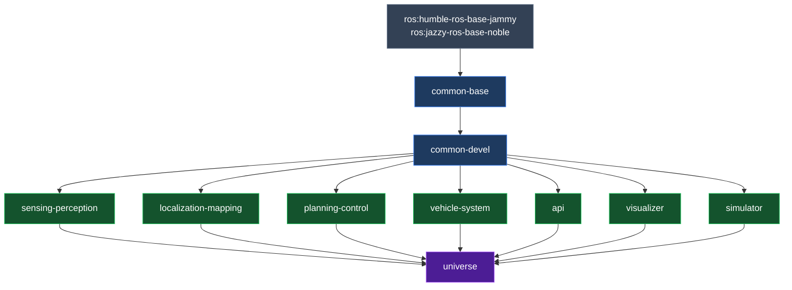

# Components

Open AD Kit is a component-based project designed to run on a variety of platforms with containerized services. Each **Autoware function** remains independently deployable, while the published images group closely related functions together to keep the runtime layout simpler.

## Build Pipeline

### Build Groups

| Group | Description | Targets |
|-------|-------------|---------|
| `common` | Common base and development images | base, devel, base-cuda, devel-cuda |
| `component` | Component images | sensing-perception, sensing-perception-cuda, localization-mapping, planning-control, vehicle-system, api, visualizer, simulator |
| `universe` | Universe images (aggregate) | universe, universe-cuda |

## Autoware Components

### Sensing

The sensing component is responsible for collecting data from the vehicle's sensors. The sensing component can be configured to collect data from a variety of sensors, including cameras, lidars, and radars. For more details, see the [Autoware sensing design document](https://autowarefoundation.github.io/autoware-documentation/main/design/autoware-architecture-v1/components/sensing/).

### Perception

The perception component is responsible for processing the data from the vehicle's sensors and creating a map of the environment. The perception component can be configured to use a variety of perception algorithms, including object detection, tracking, and mapping. For more details, see the [Autoware perception design document](https://autowarefoundation.github.io/autoware-documentation/main/design/autoware-architecture-v1/components/perception/).

### Mapping

The mapping component is responsible for creating a map of the environment. The mapping component can be configured to use a variety of mapping algorithms, including occupancy grid mapping and point cloud mapping. For more details, see the [Autoware mapping design document](https://autowarefoundation.github.io/autoware-documentation/main/design/autoware-architecture-v1/components/map/).

### Localization

The localization component is responsible for determining the vehicle's position in the map. The localization component can be configured to use a variety of localization algorithms, including GPS, IMU, and visual odometry. For more details, see the [Autoware localization design document](https://autowarefoundation.github.io/autoware-documentation/main/design/autoware-architecture-v1/components/localization/).

### Planning

The planning component is responsible for planning the vehicle's path. The planning component can be configured to use a variety of planning algorithms, including route planning, goal planning, and behavior planning. For more details, see the [Autoware planning design document](https://autowarefoundation.github.io/autoware-documentation/main/design/autoware-architecture-v1/components/planning/).

### Control

The control component is responsible for controlling the vehicle's actuators. The control component can be configured to use a variety of control algorithms, including PID and MPC. For more details, see the [Autoware control design document](https://autowarefoundation.github.io/autoware-documentation/main/design/autoware-architecture-v1/components/control/).

### Vehicle and System

The `vehicle-system` image packages both the vehicle interface and system-level services used by the Open AD Kit deployments. On the functional side, the vehicle component manages vehicle-specific interfaces and state, while the system component provides health monitoring and related system services. For more details, see the [Autoware vehicle design document](https://autowarefoundation.github.io/autoware-documentation/main/design/autoware-architecture-v1/components/vehicle/).

### API

The API component is responsible for providing the [AD API](https://autowarefoundation.github.io/autoware-documentation/main/design/autoware-interfaces/ad-api/) interface for the vehicle's state. The API component can be configured to enable or disable various interfaces. For more details, see the [Autoware Interface design document](https://autowarefoundation.github.io/autoware-documentation/main/design/autoware-architecture-v1/interfaces/).

### Simulator

The `simulator` image packages the Autoware simulator modules, providing a virtual environment for testing the autonomous driving stack without requiring real-world sensors or vehicles. It enables closed-loop simulation for validation, CI, and local development.

### Visualizer

The `visualizer` image provides a browser-accessible RViz environment via noVNC, allowing remote inspection of Autoware topics and state. It is designed as a lightweight component that can be deployed alongside the core stack or on a separate machine for remote monitoring.

#### Visualizer Settings

The following environment variables can be configured when launching the visualizer container:

| Variable | Default Value | Possible Values | Description |
|----------|---------------|-----------------|-------------|
| `RVIZ_CONFIG` | `/autoware/rviz/autoware.rviz` | Any valid path | The full path to the RViz configuration file inside the container |
| `REMOTE_DISPLAY` | `true` | `true`, `false` | **(Recommended)** Browser-based RViz display accessible from any device. Set to `false` to launch a local RViz2 display |
| `REMOTE_PASSWORD` | `openadkit` | Any string without special characters | Password for the remote display (only used when `REMOTE_DISPLAY=true`) |

### CARLA Interface

The `carla-interface` image packages the `autoware_carla_interface` bridge, enabling closed-loop end-to-end simulation with the [CARLA](https://carla.org/) simulator. It connects Autoware's control outputs to CARLA's ego vehicle and translates CARLA sensor data into Autoware-compatible messages.
