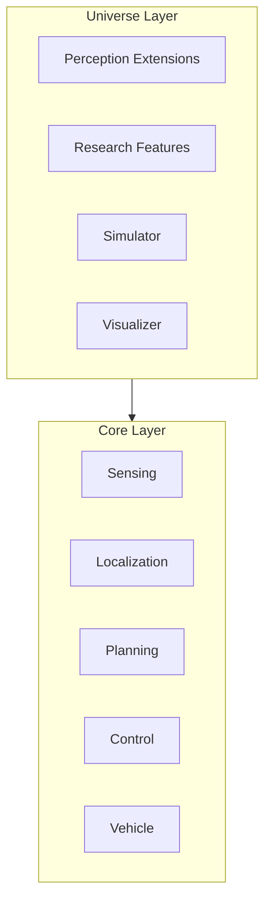
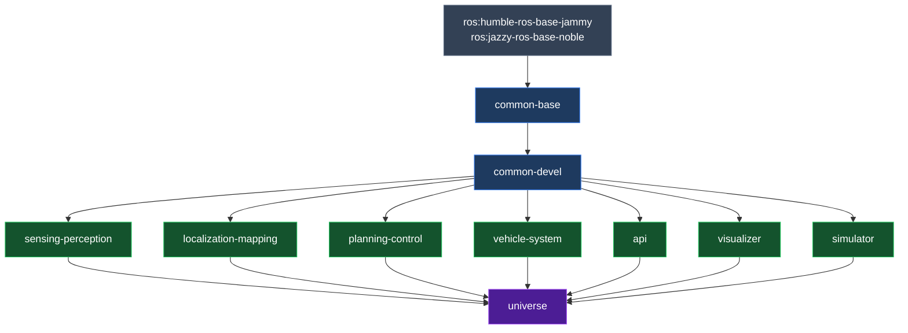
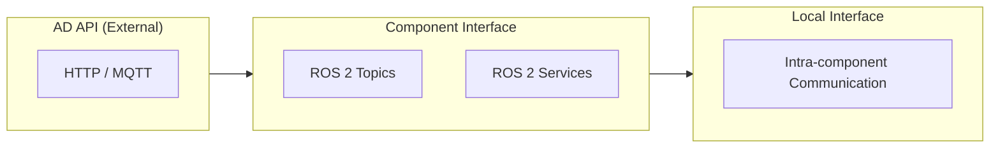

# Components

Open AD Kit is a component-based project designed to run on a variety of platforms with containerized services. Each **Autoware function** remains independently deployable, while the published images group closely related functions together to keep the runtime layout simpler.

## Architecture Overview

Autoware uses a **Core / Universe** architecture. **Core** contains rigorously reviewed base functionality required for safe autonomous driving. **Universe** contains community extensions and research features that build on the Core foundation. Open AD Kit packages these into focused container images that can be composed into complete AD systems.

## Build Pipeline

### Build Groups

| Group | Description | Targets |
|-------|-------------|---------|
| `common` | Common base and development images | base, devel, base-cuda, devel-cuda |
| `component` | Component images | sensing-perception, sensing-perception-cuda, localization-mapping, planning-control, vehicle-system, api, visualizer, simulator |
| `universe` | Universe images (aggregate) | universe, universe-cuda |

## Interface Layers

Autoware defines three formal interface categories that govern how components communicate:

<strong>AD API</strong>
External interface for fleet management and HMI. Uses HTTP/MQTT and ROS topics for vehicle state queries and commands.

<strong>Component Interface</strong>
Internal inter-module communication via ROS 2 topics and services. Standardized message types ensure compatibility across components.

<strong>Local Interface</strong>
Intra-component communication within a single image. Implementation details that do not cross component boundaries.

## Autoware Components

### Sensing

The sensing component is responsible for collecting data from the vehicle's sensors. It supports a variety of sensor modalities:

- **LiDAR** — Point cloud data acquisition and preprocessing
- **Cameras** — Image capture and distortion correction
- **Radar** — Radar target detection and tracking
- **Ultrasonics** — Short-range obstacle detection
- **GNSS-INS** — Global positioning and inertial navigation preprocessing

For more details, see the [Autoware sensing design document](https://autowarefoundation.github.io/autoware-documentation/main/design/autoware-architecture-v1/components/sensing/).

### Perception

The perception component processes sensor data to create an understanding of the environment. It includes:

- **Object detection** — Multi-class detection using camera, LiDAR, and radar fusion
- **Object tracking** — Multi-Object Tracking v2 for temporal consistency
- **Priority Object Merger** — Resolution of overlapping detections
- **Camera-Only 3D Detection** — Monocular depth estimation
- **Radar-Only 3D Detection** — Radar-based object localization
- **Cluster-Based 3D Detection** — Unsupervised LiDAR clustering

For more details, see the [Autoware perception design document](https://autowarefoundation.github.io/autoware-documentation/main/design/autoware-architecture-v1/components/perception/).

### Mapping

The mapping component creates and maintains a representation of the environment. It supports:

- **Occupancy grid mapping** — 2D grid-based environment representation
- **Point cloud mapping** — 3D map construction from LiDAR data

For more details, see the [Autoware mapping design document](https://autowarefoundation.github.io/autoware-documentation/main/design/autoware-architecture-v1/components/map/).

### Localization

The localization component determines the vehicle's position within the map. It can be configured to use:

- **GNSS/RTK** — Global positioning with real-time kinematic correction
- **IMU** — Inertial measurement for dead reckoning
- **Visual odometry** — Camera-based motion estimation
- **LiDAR localization** — Point cloud matching against the HD map

For more details, see the [Autoware localization design document](https://autowarefoundation.github.io/autoware-documentation/main/design/autoware-architecture-v1/components/localization/).

### Planning

The planning component produces the driving trajectory. It encompasses:

- **Route planning** — High-level path selection from start to goal
- **Behavior planning** — Lane selection, intersection handling, emergency decisions
- **Motion planning** — Smooth trajectory generation with obstacle avoidance
- **Goal planning** — Final approach and parking maneuvers

For more details, see the [Autoware planning design document](https://autowarefoundation.github.io/autoware-documentation/main/design/autoware-architecture-v1/components/planning/).

### Control

The control component follows the planned trajectory by actuating the vehicle. It supports:

- **PID control** — Proportional-Integral-Derivative feedback for steering and velocity
- **MPC control** — Model Predictive Control for optimal trajectory tracking
- **Vehicle command interface** — Translation of control outputs to vehicle-specific actuation

For more details, see the [Autoware control design document](https://autowarefoundation.github.io/autoware-documentation/main/design/autoware-architecture-v1/components/control/).

### Vehicle and System

The `vehicle-system` image packages both the **vehicle interface** and **system-level services** used by Open AD Kit deployments:

- **Vehicle interface** — Manages vehicle-specific actuation and state reporting
- **System services** — Health monitoring, diagnostics, and system-level orchestration

For more details, see the [Autoware vehicle design document](https://autowarefoundation.github.io/autoware-documentation/main/design/autoware-architecture-v1/components/vehicle/).

### API

The API component provides the [AD API](https://autowarefoundation.github.io/autoware-documentation/main/design/autoware-interfaces/ad-api/) interface for external systems to interact with the vehicle. It exposes:

- Vehicle state queries (position, velocity, mode)
- Operation mode transitions (autonomous, manual, stop)
- Route and goal setting
- Emergency stop commands

For more details, see the [Autoware Interface design document](https://autowarefoundation.github.io/autoware-documentation/main/design/autoware-architecture-v1/interfaces/).

### Simulator

The `simulator` image packages the Autoware simulator modules, providing a virtual environment for testing the autonomous driving stack without requiring real-world sensors or vehicles. It enables:

- **Closed-loop simulation** — Full AD stack in simulation for validation and CI
- **Scenario-based testing** — Predefined traffic scenarios for regression testing
- **Local development** — Rapid iteration without hardware dependencies

### Visualizer

The `visualizer` image provides a browser-accessible RViz environment via noVNC, allowing remote inspection of Autoware topics and state. It is designed as a lightweight component that can be deployed alongside the core stack or on a separate machine for remote monitoring.

#### Visualizer Settings

The following environment variables can be configured when launching the visualizer container:

| Variable | Default Value | Possible Values | Description |
|----------|---------------|-----------------|-------------|
| `RVIZ_CONFIG` | `/autoware/rviz/autoware.rviz` | Any valid path | The full path to the RViz configuration file inside the container |
| `REMOTE_DISPLAY` | `true` | `true`, `false` | **(Recommended)** Browser-based RViz display accessible from any device. Set to `false` to launch a local RViz2 display |
| `REMOTE_PASSWORD` | `openadkit` | Any string without special characters | Password for the remote display (only used when `REMOTE_DISPLAY=true`) |

### CARLA Interface

The `carla-interface` image packages the `autoware_carla_interface` bridge, enabling closed-loop end-to-end simulation with the [CARLA](https://carla.org/) simulator. It connects Autoware's control outputs to CARLA's ego vehicle and translates CARLA sensor data into Autoware-compatible messages.

## End-to-End Roadmap

Autoware is evolving toward end-to-end autonomous driving through a phased roadmap. While Open AD Kit currently packages the modular v1 architecture, the project is tracking these advancements:

**Phase 1 — Learned Planning**: Introduction of learned trajectory planning modules alongside classical planners.

**Phase 2 — Learned Perception**: Integration of learned perception pipelines (detection, tracking, prediction) with traditional safety-critical modules.

**Phase 3 — Monolithic Network**: A unified learned driving network handling perception through control.

**Phase 4 — Learned Hybrid**: A monolithic learned network backed by dedicated safety perception modules for guaranteed collision avoidance.

For the full roadmap, see the [Autoware Architecture v2 Roadmap](https://autowarefoundation.github.io/autoware-documentation/main/design/autoware-architecture-v2/roadmap/).

## Related

- [Deployments](../deployments/index.md) — How to compose components into running systems
- [Getting Started](../getting-started/index.md) — Quick start guide
- [Supported Platforms](../platforms/index.md) — Where to deploy

