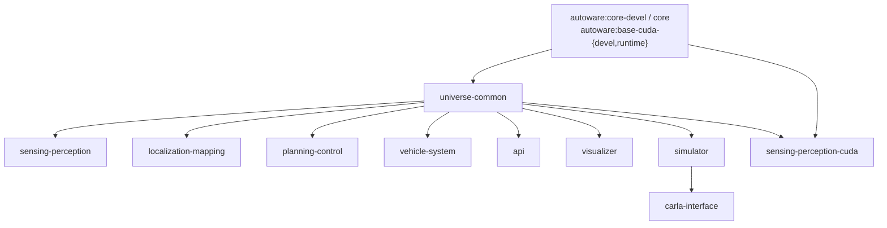
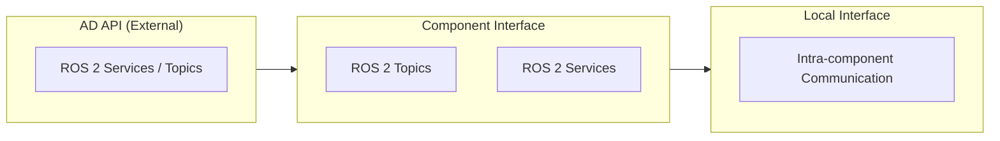

# Components

Open AD Kit is a component-based project designed to run on a variety of platforms with containerized services. Each **Autoware function** remains independently deployable, while the published images group closely related functions together to keep the runtime layout simpler.

## Architecture Overview

Autoware uses a **Core / Universe** architecture. **Core** contains rigorously reviewed base functionality required for safe autonomous driving. **Universe** contains community extensions and research features that build on the Core foundation. Open AD Kit packages Universe components into focused container images that can be composed into complete AD systems.

## Build Pipeline



`universe-common` is an Open AD Kit-owned thin intermediate built on top of the
upstream `autoware:core-devel`/`core` images. The bake groups and build commands
are documented under [Building from source](#building-from-source) below.

## Interface Layers

Autoware defines three formal interface categories that govern how components communicate:

<div class="oak-component-grid">

<div class="oak-component-item">
<strong>AD API</strong>
<span>External interface for fleet management and HMI. Exposed as ROS 2 services and topics for vehicle state queries and commands; external gateways (e.g. HTTP/MQTT) can be layered on top.</span>
</div>

<div class="oak-component-item">
<strong>Component Interface</strong>
<span>Internal inter-module communication via ROS 2 topics and services. Standardized message types ensure compatibility across components.</span>
</div>

<div class="oak-component-item">
<strong>Local Interface</strong>
<span>Intra-component communication within a single image. Implementation details that do not cross component boundaries.</span>
</div>

</div>



## Autoware Components

Each Autoware function is packaged into a focused container image. Select a component from the sidebar or explore the pages below.

<div class="oak-component-grid">

<div class="oak-component-item">
<strong><a href="sensing/">Sensing</a></strong>
<span>LiDAR, cameras, radar, ultrasonics, and GNSS-INS preprocessing.</span>
</div>

<div class="oak-component-item">
<strong><a href="perception/">Perception</a></strong>
<span>Object detection, tracking, and multi-sensor fusion.</span>
</div>

<div class="oak-component-item">
<strong><a href="mapping/">Mapping</a></strong>
<span>Loads and serves Lanelet2 vector maps and 3D point cloud maps.</span>
</div>

<div class="oak-component-item">
<strong><a href="localization/">Localization</a></strong>
<span>GNSS, IMU, visual odometry, and LiDAR map matching.</span>
</div>

<div class="oak-component-item">
<strong><a href="planning/">Planning</a></strong>
<span>Route, behavior, motion, and goal planning.</span>
</div>

<div class="oak-component-item">
<strong><a href="control/">Control</a></strong>
<span>PID and MPC trajectory tracking with vehicle actuation.</span>
</div>

<div class="oak-component-item">
<strong><a href="vehicle-system/">Vehicle and System</a></strong>
<span>Vehicle interface and system-level orchestration services.</span>
</div>

<div class="oak-component-item">
<strong><a href="api/">API</a></strong>
<span>AD API for external fleet management and HMI integration.</span>
</div>

<div class="oak-component-item">
<strong><a href="simulator/">Simulator</a></strong>
<span>Closed-loop simulation for validation and local development.</span>
</div>

<div class="oak-component-item">
<strong><a href="visualizer/">Visualizer</a></strong>
<span>Browser-accessible RViz2 via noVNC for remote monitoring.</span>
</div>

<div class="oak-component-item">
<strong><a href="carla-interface/">CARLA Interface</a></strong>
<span>Bridge for closed-loop simulation with the CARLA simulator.</span>
</div>

</div>

## Image Reference

The published component images and their platforms. This table is generated from
the image catalog (`.github/image-inventory.json`), so it always matches what CI
builds. See [Container Image Tags](../getting-started/image-tags.md) for the tag
naming scheme.

{{ component_table() }}

## Building from source

Open AD Kit images are built with `docker buildx bake` using
[`components/docker-bake.hcl`](https://github.com/autowarefoundation/openadkit/blob/main/components/docker-bake.hcl).
The build graph is:

```
upstream autoware:core-devel / core / base-cuda-{devel,runtime}
        │
        ▼
universe-common  (openadkit-owned thin intermediate)
        │
        ▼
seven non-CUDA component images (sensing-perception,
localization-mapping, planning-control, vehicle-system,
api, visualizer, simulator)
```

`sensing-perception-cuda` is a parallel CUDA branch: it inherits from
upstream `base-cuda-{devel,runtime}` and additionally grafts in the
`universe-common` install tree (so it has both CUDA toolkit access and the
universe-common compiled packages).

`carla-interface` is an amd64-only component image built on top of
`simulator`; it is part of the `component` bake group but is published for
amd64 only.

The `universe-common` layer compiles only the universe-common slice of
Autoware on top of upstream `core-devel`/`core`; everything below
`universe-common` (base OS, ROS, core) is owned and built by upstream.

### Bake groups

| Group | Targets |
|-------|---------|
| `default` | everything: `universe-common` + `component` |
| `universe-common` | `universe-common-devel`, `universe-common` |
| `component` | the seven non-CUDA component images plus `sensing-perception-cuda` and `carla-interface` |

### Upstream pin

The `UPSTREAM_TAG` bake variable pins the upstream Autoware release the
images are built against. CI sets it from a repository Variable; leaving it
empty uses upstream's plain `<name>-<distro>` multi-arch tag.

## CI pipeline

`build-all-images.yaml` builds the universe-common graph on pushes,
schedules, and manual dispatch. It walks the `{humble, jazzy} × {amd64,
arm64}` matrix through staged jobs — `prepare`, then `build-common` and
`build-components` — so each layer is pushed before the
layer that depends on it. A final `create-manifests` job stitches the
per-arch tags into multi-arch manifests via the `combine-multi-arch-images`
composite action. `release-all-images.yaml` runs on a schedule to track
Autoware release tags and build the matching single-arch release images.

## Open AD Kit Roadmap

Open AD Kit tracks Autoware's architecture evolution upstream, but its own roadmap is focused on **deployment** — containerization, platform support, release trust, and CI/CD — rather than on the autonomy algorithms themselves. The goal is to package whatever Autoware ships into clean, composable, deployment-ready images.

!!! note "Roadmap"
    The 2026–2027 Open AD Kit roadmap has been ratified and is published in the repository. See the [Roadmap](../roadmap.md) for the full release ladder. Current focus areas include:

    - **Containerization** — Splitting the monolithic stack into focused component images and retiring `autoware:universe` fallbacks (see [Logging Simulation Known Limitations](../deployment/logging-simulation/index.md#known-limitations) and [Zenoh Bridge Known Limitations](../deployment/zenoh-bridge/index.md#known-limitations)).
    - **Platform support** — Expanding verified coverage across edge and cloud targets (see [Platforms](../platforms/index.md)).
    - **Release trust and CI/CD** — Multi-architecture builds, image scanning, and a reproducible release flow (see [Release Flow](../getting-started/release-flow.md)).

For Autoware's upstream autonomy direction, see the [Autoware architecture documentation](https://autowarefoundation.github.io/autoware-documentation/main/design/).

## Related

- [Deployments](../deployment/index.md) — How to compose components into running systems
- [Getting Started](../getting-started/index.md) — Quick start guide
- [Supported Platforms](../platforms/index.md) — Where to deploy
