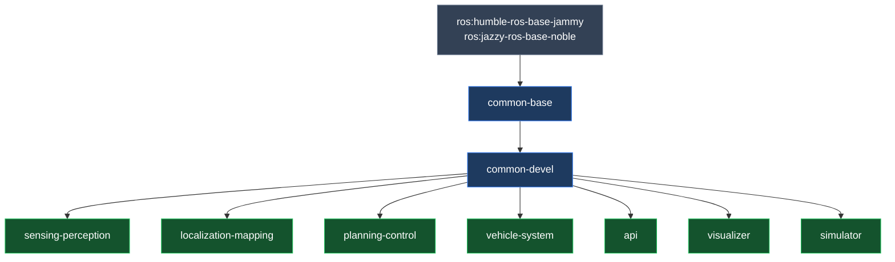
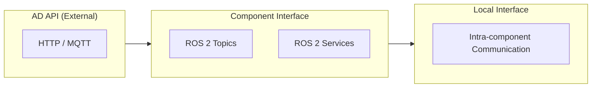
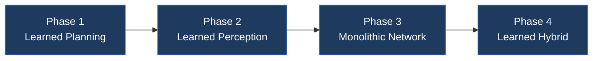

# Components

Open AD Kit is a component-based project designed to run on a variety of platforms with containerized services. Each **Autoware function** remains independently deployable, while the published images group closely related functions together to keep the runtime layout simpler.

## Architecture Overview

Autoware uses a **Core / Universe** architecture. **Core** contains rigorously reviewed base functionality required for safe autonomous driving. **Universe** contains community extensions and research features that build on the Core foundation. Open AD Kit packages Core components into focused container images that can be composed into complete AD systems.

## Build Pipeline

### Build Groups

| Group | Description | Targets |
|-------|-------------|---------|
| `common` | Common base and development images | base, devel, base-cuda, devel-cuda |
| `component` | Component images | sensing-perception, sensing-perception-cuda, localization-mapping, planning-control, vehicle-system, api, visualizer, simulator |

## Interface Layers

Autoware defines three formal interface categories that govern how components communicate:

<strong>AD API</strong>
External interface for fleet management and HMI. Uses HTTP/MQTT and ROS topics for vehicle state queries and commands.

<strong>Component Interface</strong>
Internal inter-module communication via ROS 2 topics and services. Standardized message types ensure compatibility across components.

<strong>Local Interface</strong>
Intra-component communication within a single image. Implementation details that do not cross component boundaries.

## Autoware Components

Each Autoware function is packaged into a focused container image. Select a component from the sidebar or explore the pages below.

<strong><a href="sensing/">Sensing</a></strong>
LiDAR, cameras, radar, ultrasonics, and GNSS-INS preprocessing.

<strong><a href="perception/">Perception</a></strong>
Object detection, tracking, and multi-sensor fusion.

<strong><a href="mapping/">Mapping</a></strong>
Occupancy grid and point cloud map construction.

<strong><a href="localization/">Localization</a></strong>
GNSS, IMU, visual odometry, and LiDAR map matching.

<strong><a href="planning/">Planning</a></strong>
Route, behavior, motion, and goal planning.

<strong><a href="control/">Control</a></strong>
PID and MPC trajectory tracking with vehicle actuation.

<strong><a href="vehicle-system/">Vehicle and System</a></strong>
Vehicle interface and system-level orchestration services.

<strong><a href="api/">API</a></strong>
AD API for external fleet management and HMI integration.

<strong><a href="simulator/">Simulator</a></strong>
Closed-loop simulation for validation and local development.

<strong><a href="visualizer/">Visualizer</a></strong>
Browser-accessible RViz via noVNC for remote monitoring.

<strong><a href="carla-interface/">CARLA Interface</a></strong>
Bridge for closed-loop simulation with the CARLA simulator.

## End-to-End Roadmap

Autoware is evolving toward end-to-end autonomous driving through a phased roadmap. While Open AD Kit currently packages the modular v1 architecture, the project is tracking these advancements:

<ol class="oak-steps" markdown="1">

1. **Phase 1 — Learned Planning** — Introduction of learned trajectory planning modules alongside classical planners.
2. **Phase 2 — Learned Perception** — Integration of learned perception pipelines (detection, tracking, prediction) with traditional safety-critical modules.
3. **Phase 3 — Monolithic Network** — A unified learned driving network handling perception through control.
4. **Phase 4 — Learned Hybrid** — A monolithic learned network backed by dedicated safety perception modules for guaranteed collision avoidance.

</ol>

For the full roadmap, see the [Autoware Architecture v2 Roadmap](https://autowarefoundation.github.io/autoware-documentation/main/design/autoware-architecture-v2/roadmap/).

## Related

- [Deployments](../deployments/index.md) — How to compose components into running systems
- [Getting Started](../getting-started/index.md) — Quick start guide
- [Supported Platforms](../platforms/index.md) — Where to deploy

