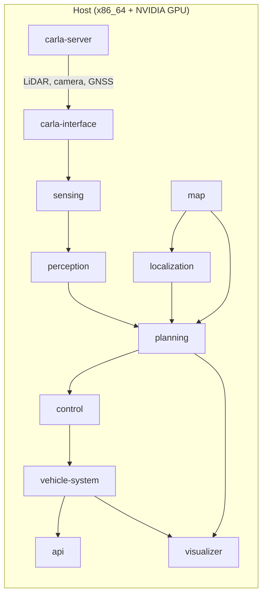

# CARLA Simulation

!!! abstract ""
    The CARLA Simulation deployment runs a **closed-loop CARLA 0.9.16 end-to-end simulation** with the modular Open AD Kit containers and Autoware's `autoware_carla_interface`. The full Autoware stack — sensing, perception, localization, planning, control — drives a CARLA ego vehicle inside a photorealistic virtual world.

## What You Will See

After starting the deployment, the CARLA server renders the `Town01` world and the Autoware stack perceives and drives within it:

- CARLA sensor data (LiDAR, cameras, IMU, GNSS) translated into Autoware ROS 2 messages
- The full perception, localization, and planning pipeline operating on simulated sensors
- Autoware control commands actuating the CARLA ego vehicle in closed loop
- Full RViz2 visualization via the noVNC browser interface

## Prerequisites

- An **amd64 (x86_64)** host with Docker — the `carla-interface` image is published for **amd64 and ROS 2 Humble only**; there is no arm64 image
- Docker Engine with the NVIDIA Container Toolkit (set up via `setup.sh`)
- An NVIDIA GPU — the CARLA server requires GPU rendering
- A working host X display (usually `DISPLAY=:0`) with X access for local containers (e.g. `xhost +SI:localuser:root`)
- Host NVIDIA Vulkan ICD at `/usr/share/vulkan/icd.d/nvidia_icd.json`

!!! warning "GPU Required"
    Unlike the other deployments, CARLA itself is GPU-rendered. This deployment does not run on CPU-only machines.

## Before You Start

No `git clone` required.

### 1. Set up the environment (one-time)

```bash
{{ setup_command }}
```

### 2. Download the deployment bundle

```bash
curl -fL https://github.com/autowarefoundation/openadkit/releases/latest/download/carla-simulation.tar.gz | tar xz
cd carla-simulation
```

!!! note "Releases"
    Deployment bundles ship as assets on each [GitHub Release](https://github.com/autowarefoundation/openadkit/releases). Until the first official release is published, developers can use the `deployments/carla-simulation/` folder from a cloned repository instead.

## Start the Deployment

```bash
./start-carla-e2e-demo.sh
```

!!! note "Cloned repository"
    If running from a cloned repository, ensure you have also sourced `../base/base.env` so that shared variables such as `ROS_DOMAIN_ID` and `REMOTE_PASSWORD` are set.

The helper script:

- Downloads the official CARLA Autoware `Town01` map assets if missing
- Starts the `carlasim/carla:0.9.16` server and preloads `Town01`
- Starts the modular Open AD Kit containers (map, system, CARLA interface, sensing, perception, localization, planning, vehicle, control, API)
- Starts the browser RViz2/noVNC visualizer
- Verifies localization, CARLA LiDAR data, and the CARLA ego actor

The default behavior is **no-drive**: set a route and engage manually in RViz2.

## Access the Visualizer

Open your browser and navigate to:

```text
http://localhost:6080/vnc.html
```

Use the default password **`openadkit`**.

--8<-- "includes/visualizer-remote-access.md"

In RViz2:

1. Use **2D Goal Pose** to set a route
2. Wait for routing and planning to become available
3. Click **Auto** to engage autonomous driving

## Optional Drive Check

To automatically set a short forward route, engage autonomous mode, and verify movement:

```bash
./start-carla-e2e-demo.sh --drive
```

## Stop the Deployment

```bash
docker compose --env-file carla-simulation.env down
```

## Troubleshooting

| Issue | Solution |
|-------|----------|
| CARLA server fails to start | Verify the NVIDIA Container Toolkit is installed and `nvidia-smi` works |
| Black or frozen CARLA window | Check host X access (`xhost +SI:localuser:root`) and the Vulkan ICD path |
| Visualizer blank | Wait for all containers to initialize, then refresh the browser |
| Ego vehicle does not move | Set a route with **2D Goal Pose** and click **Auto**, or use `--drive` |

## Architecture

The CARLA simulation connects the Unreal Engine simulator to the full Autoware stack through a dedicated bridge:



CARLA server generates synthetic sensor data. The `carla-interface` container translates CARLA formats to ROS 2 messages that the standard Open AD Kit sensing, perception, and localization containers consume. From there the pipeline follows the same planning → control → vehicle flow as the other simulations.

## Related

- [CARLA Interface component](../../components/carla-interface.md) — What the bridge image contains
- [Planning Simulation](../planning-simulation/index.md) — Simpler planning-focused simulation
- [Logging Simulation](../logging-simulation/index.md) — Replay recorded sensor data
