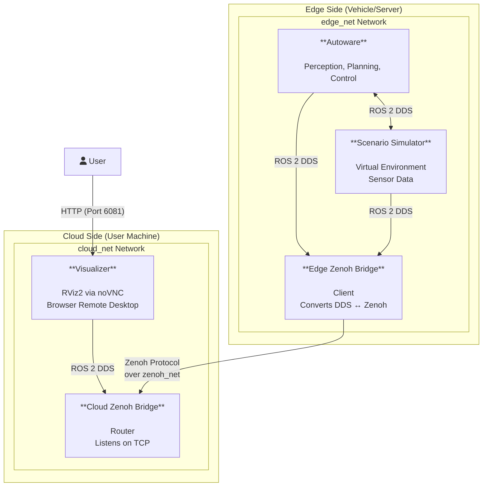
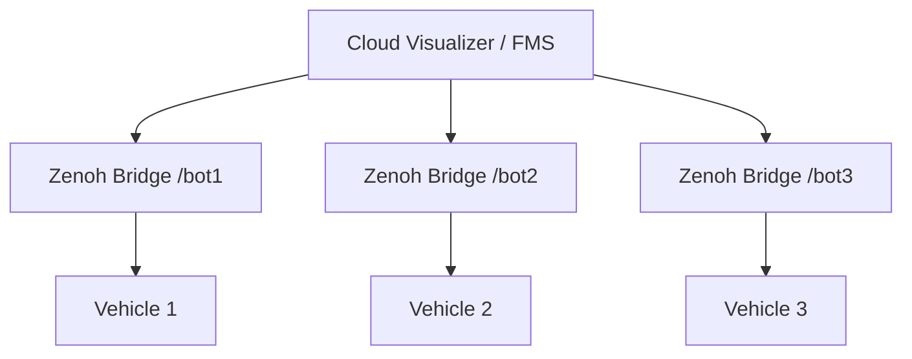

# Zenoh Bridge Demo

!!! abstract ""
    This demo demonstrates a distributed deployment pattern for Open AD Kit: separating compute-intensive components (perception, planning, simulation) on an edge server from lightweight visualization and control on a remote machine. Zenoh bridges the two isolated ROS 2 environments with high-performance, low-latency communication.

!!! abstract "When to Use This Demo"
    Use the Zenoh Bridge demo when you need to:

    - **Remotely visualize** an Autoware stack running on a vehicle or powerful simulation server
    - **Separate compute and display** to optimize resource usage on each machine
    - **Validate cloud-edge architecture** before production deployment
    - **Manage multiple vehicles** from a central monitoring station (via Zenoh namespaces)

## Demo Video

[![[openadkit x zenoh-bridge] remote control (cloud/edge) demo](https://img.youtube.com/vi/6yhhxlVQTKI/0.jpg)](https://www.youtube.com/watch?v=6yhhxlVQTKI)

| Time | Description |
|------|-------------|
| 00:00 | Start cloud services |
| 00:16 | Start edge services |
| 00:52 | Demo: Stop, planning, resume |
| 01:53 | Stop edge and cloud services |

## Architecture

### Edge-Cloud Model

The system decouples the monolithic stack into two domains:

- **Edge Side** — High computational demand (CPU/GPU)
  - `autoware`: Core perception, decision-making, and planning modules
  - `scenario_simulator`: Generates virtual traffic environments and sensor data
  - **Deployment**: Vehicle compute unit or powerful simulation server

- **Cloud Side** — Lightweight interaction and visualization
  - `visualizer`: Browser-accessible RViz2 via noVNC; no local ROS 2 installation required
  - **Deployment**: Laptop, workstation, or cloud management system

### Architecture Diagram



### Network Isolation and Communication Bridge

- **`edge_net`** — Isolated virtual network for `autoware` and `scenario_simulator`. Uses ROS 2 DDS multicast for low-latency local communication.
- **`cloud_net`** — Isolated network for `visualizer`, simulating physical or logical separation.
- **`zenoh_net`** — Bridges `edge_zenoh_bridge` and `cloud_zenoh_bridge` across domains. Zenoh replaces raw DDS multicast with a tunneled TCP connection, enabling cross-network operation.

### Zenoh Bridge Configuration

- **`cloud_zenoh_bridge`** — Acts as a **Router**, listening for client connections on **TCP 7448** (configured via `-l tcp/0.0.0.0:7448` in `docker-compose.yaml`).
- **`edge_zenoh_bridge`** — Acts as a **Client**, connecting to the cloud router on port `7448` via `zenoh_net` (or `${CLOUD_IP}:7448` in multi-machine setups). It scans ROS 2 topics in `edge_net`, converts them to Zenoh, and forwards to the router. Its own local listener uses TCP 7447.
- **`config/zenoh-bridge-ros2dds.json5`** — Defines bridge mode, endpoints, and topic filtering rules. Filtering allows precise bandwidth control by excluding high-frequency or irrelevant topics.

!!! warning "Prevent DDS Cross-Traffic"
    When bridging two ROS 2 domains, ensure they cannot discover each other via native DDS multicast. Use `ROS_DOMAIN_ID` separation or configure `CYCLONEDDS_URI` to restrict interfaces. Otherwise, topics may be duplicated across both networks.

### Multi-Vehicle Namespace Support

Zenoh supports **namespace-based multi-vehicle management** by assigning a unique namespace to each bridge:

```json5
{
  namespace: "/bot1"
}
```

This allows a single cloud visualizer or fleet management station to connect to multiple vehicles without reconfiguring ROS nodes on each vehicle. The `zenoh_autoware_fms` prototype demonstrates this pattern on ADLINK ADM-AL30 hardware.

## Prerequisites

- Docker Engine + Docker Compose (set up via `setup.sh`, below)
- Stable internet connection for pulling images

## Setup

### 1. Set up the environment (one-time)

```bash
curl -fsSL https://raw.githubusercontent.com/autowarefoundation/openadkit/main/setup.sh | sudo bash
```

### 2. Download the deployment bundle and sample map

```bash
curl -fL https://github.com/autowarefoundation/openadkit/releases/latest/download/zenoh-bridge.tar.gz | tar xz
cd zenoh-bridge
./fetch-sample-data.sh zenoh-bridge
```

!!! note "Releases"
    Deployment bundles ship as assets on each [GitHub Release](https://github.com/autowarefoundation/openadkit/releases). Until the first official release is published, developers can use the `deployments/demos/zenoh-bridge/` folder from a cloned repository instead.

### 3. Verify Directory Structure

```text
.
├── README.md
├── docker-compose.yaml
├── cloud.sh
├── edge.sh
└── config/
    └── zenoh-bridge-ros2dds.json5
```

Modify `config/zenoh-bridge-ros2dds.json5` to filter topics as needed.

### 4. Configure Environment Variables

Edit the `.env` file to customize your deployment. Key variables:

| Variable | Description | Default |
|----------|-------------|---------|
| `CLOUD_IP` | IP address or hostname of the cloud machine (used by edge bridge to connect) | `cloud_zenoh_bridge` (Docker DNS, single-host only) |
| `MAP_PATH` | Host path to the map directory | `$HOME/autoware_map/kashiwanoha_map` |
| `REMOTE_PASSWORD` | Password for noVNC visualizer (port 6080/6081). **Required — must be set before starting.** | (none) |
| `SCENARIO_SIMULATION` | Enable scenario simulator (`true`/`false`) | `true` |

For **split topology** (multi-machine), you must set `CLOUD_IP` to the actual IP of the cloud machine. See [Option A: Split Topology](#option-a-split-topology-recommended) below.

## Starting the System

### Option A: Split Topology (Recommended)

Separate Edge and Cloud components to simulate a real-world distributed environment.

```bash
# Terminal 1: Start Edge components (Autoware, Simulator, Edge Bridge)
./edge.sh up -d

# Terminal 2: Start Cloud components (Visualizer, Cloud Bridge)
./cloud.sh up -d
```

### Option B: Monolithic Deployment

Run everything on a single machine using standard Docker Compose.

```bash
docker compose up -d
```

The initial launch may take several minutes to download images.

### Option C: Distributed Deployment (Multi-Machine)

Deploy on separate machines (e.g., one Cloud, one Edge):

**1. Cloud Machine:**

```bash
./cloud.sh
# [Info] Cloud services started.
#        To connect from Edge, set CLOUD_IP to one of the following:
#        [Public/Routable IPs]
#        - 192.168.1.100
```

**2. Edge Machine:**

```bash
export CLOUD_IP=192.168.1.100
./edge.sh
```

### Monitor Startup Logs

```bash
docker compose logs -f
```

## Verification and Usage

### 1. Check Container Status

Run `docker ps` or `docker compose ps` to verify all containers are running:

- `autoware`
- `scenario_simulator`
- `visualizer`
- `edge_zenoh_bridge`
- `cloud_zenoh_bridge`

### 2. Access the Visualizer

Open a web browser and navigate to:

```text
http://localhost:6081
```

Log in with the password you set as `REMOTE_PASSWORD` in `.env`.

### 3. Verify Operation

- The noVNC interface should display RViz2.
- If **Global Status** in the RViz2 Displays panel shows `OK` (green), the system is running correctly. You should see maps, the vehicle model, and simulated objects.
- If it shows **Warning**, see the troubleshooting section below.

### 4. Stop the System

```bash
# Stop Cloud
./cloud.sh down

# Stop Edge
./edge.sh down

# Stop everything
docker compose down
```

The map is mounted read-only from `~/autoware_map/kashiwanoha_map` on the host, so stopping the stack leaves it untouched. Re-fetch it any time with `./fetch-sample-data.sh zenoh-bridge`.

## Teleoperation (Optional)

A containerized terminal-based teleoperation interface lets you drive the vehicle manually from the cloud side.

### 1. Start the Teleop Backend

The teleop service only starts when the cloud side is launched with `--with-teleop`:

```bash
./cloud.sh up --with-teleop -d
```

For the edge side, the default simulation mode works, but pure control testing without scenario interference is cleaner with `--no-sim`:

```bash
./edge.sh --no-sim up -d
```

### 2. Launch the Interface

```bash
./run_teleop.sh
```

### 3. Controls

| Key | Function | Description |
|-----|----------|-------------|
| **W** | Throttle | Accelerate |
| **S** | Brake | Decelerate |
| **A** | Turn Left | Steer left |
| **D** | Turn Right | Steer right |
| **Z** | Auto/Local | **Toggle control mode** (must be in Local/External to drive) |
| **M** | Switch Mode | Cycle modes: `STOP` → `PHYSICS` → `CRUISE` |
| **X** | Gear: Drive | Shift to Drive (D) |
| **C** | Gear: Reverse | Shift to Reverse (R) |
| **V** | Gear: Park | Shift to Park (P) |
| **Space** | Emergency Stop | Immediate max braking / resume |
| **R** | Reset Pose | Reset to initial position |
| **Q** | Quit | Exit the interface |

## Troubleshooting

### Visualizer Shows "Global Status: Warning" or Blank Screen

**Cause:** Race condition where ROS 2 nodes start before the Zenoh bridge connection is fully established. `depends_on` helps but does not guarantee readiness.

**Solutions:**

1. **Restart:**

   ```bash
   docker compose restart
   ```

2. **Staged Startup:** Start the cloud side first, wait, then start the edge side.

   ```bash
   ./cloud.sh up -d
   sleep 15
   ./edge.sh up -d
   ```

### Port Conflict (Port is already allocated)

**Cause:** Ports `6081` (noVNC), `7448` (cloud Zenoh router), or `7447` (edge Zenoh bridge) are in use.

**Solution:** Stop the conflicting program, or modify `docker-compose.yaml`. For example, change `6081:6080` to `8080:6080` and access via `http://localhost:8080`.

### Container Fails to Start with `file not found`

**Cause:** `config/zenoh-bridge-ros2dds.json5` is missing or inaccessible.

**Solution:** Verify the `config` directory and file exist. On Linux/macOS, check file permissions to ensure Docker can read them.

## Known Limitations

The `autoware` service in this deployment uses the upstream `ghcr.io/autowarefoundation/autoware:universe` image rather than an Open AD Kit component image. This is a temporary monolithic fallback while Open AD Kit migrates from monolithic to component-based architecture. OAK component images for the full monolithic stack will be available in a future release.

This demo also depends on third-party images that are **not** pinned to immutable tags: `eclipse/zenoh-bridge-ros2dds:latest` and the community `ghcr.io/evshary/autoware_manual_control` teleop image. They may change upstream without notice — pin them to a specific digest if you need a fully reproducible demo.

## Related

- [Zenoh Plugin ROS2 DDS](https://github.com/eclipse-zenoh/zenoh-plugin-ros2dds)
- [Managing Multiple Autoware Vehicles with Zenoh](https://autoware.org/managing-multiple-autoware-vehicles-with-zenoh/)
- [Driving Autoware with Zenoh](https://autoware.org/driving-autoware-with-zenoh/)
- [Sample Deployments](../../samples/index.md) — Single-machine simulations


