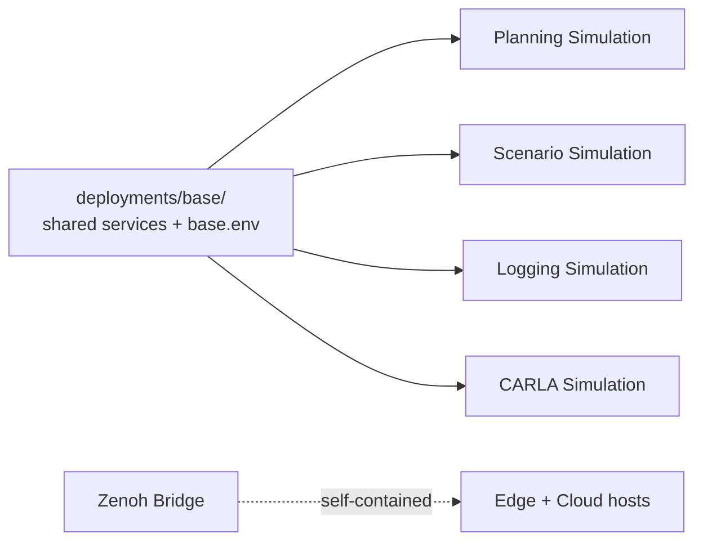

# Deployment

A **deployment** is a running instance of Open AD Kit — a specific combination of Autoware components configured to achieve a particular task, such as a simulation or a full autonomous driving stack.

Deployments are defined using container orchestration files (typically `docker-compose.yaml`), making them portable and reproducible across environments from a developer's laptop to production edge devices.

## Available Deployments

<div class="oak-card-grid" markdown="1">

<div class="oak-card" markdown="1">

:material-map-marker-path:{ .oak-card-icon }

<h3>Planning Simulation</h3>
<p>Run the Autoware planning stack against a pre-recorded point cloud map. Set a goal pose and watch the vehicle plan and follow a trajectory in a virtual environment.</p>
<p><span class="oak-badge oak-badge--neutral">Single Machine</span> <span class="oak-badge oak-badge--supported">GPU Optional</span></p>
<a href="planning-simulation/" class="md-button md-button--primary">Run Planning Simulation</a>
</div>

<div class="oak-card" markdown="1">

:material-file-document-outline:{ .oak-card-icon }

<h3>Scenario Simulation</h3>
<p>Execute predefined traffic scenarios using the official TIER IV Scenario Simulator container. Validate planning and behavior under specific conditions.</p>
<p><span class="oak-badge oak-badge--neutral">Single Machine</span> <span class="oak-badge oak-badge--supported">GPU Optional</span></p>
<a href="scenario-simulation/" class="md-button">Run Scenario Simulation</a>
</div>

<div class="oak-card" markdown="1">

:material-play-circle-outline:{ .oak-card-icon }

<h3>Logging Simulation</h3>
<p>Replay recorded sensor data (rosbag) through the full Autoware stack. Test perception, localization, and planning against real-world logged data.</p>
<p><span class="oak-badge oak-badge--neutral">Single Machine</span> <span class="oak-badge oak-badge--recommended">GPU Recommended</span></p>
<a href="logging-simulation/" class="md-button">Run Logging Simulation</a>
</div>

<div class="oak-card" markdown="1">

:material-car-sports:{ .oak-card-icon }

<h3>CARLA Simulation</h3>
<p>Closed-loop end-to-end simulation with the CARLA 0.9.16 simulator. The full Autoware stack perceives and drives a CARLA ego vehicle in a photorealistic world.</p>
<p><span class="oak-badge oak-badge--neutral">Single Machine</span> <span class="oak-badge oak-badge--required">GPU Required</span></p>
<a href="carla-simulation/" class="md-button">Run CARLA Simulation</a>
</div>

<div class="oak-card" markdown="1">

:material-lan-connect:{ .oak-card-icon }

<h3>Zenoh Bridge</h3>
<p>Distributed cloud-edge visualization. Run compute-intensive Autoware components on an edge server while remotely visualizing and controlling the stack from a lightweight cloud machine using Zenoh protocol bridging.</p>
<p><span class="oak-badge oak-badge--neutral">Multi-Machine</span> <span class="oak-badge oak-badge--neutral">Advanced</span></p>
<a href="zenoh-bridge/" class="md-button">Explore Zenoh Bridge</a>
</div>

</div>

New to Open AD Kit? Start with [Planning Simulation](planning-simulation/index.md) — it is the simplest deployment and runs on any machine.

## Architecture

All deployments share a common pattern:

1. **Component images** are pulled from the GitHub Container Registry
2. **Environment files** (`.env`) configure runtime parameters
3. **Docker Compose** orchestrates containers on a single host (or across two hosts for the Zenoh bridge)
4. **Optional: Zenoh bridge** connects distributed ROS 2 domains for remote operation

### Base + Overlay Model

Four of the five deployments (planning, scenario, logging, carla) build on a shared **base** (`deployments/base/`):

- `deployments/base/docker-compose.yaml` defines shared services (map, planning, vehicle, system, control, simulator, api, visualizer).
- Each deployment uses Compose `include:` to pull in the base, then adds only its delta (e.g. `scenario_simulator` service, GPU overlays).
- `deployments/base/base.env` holds shared defaults; each deployment adds a `<name>.env` with its overrides.
- From a cloned repo, run with **two** `--env-file`s (base first, `<name>.env` second — last wins):

  ```bash
  docker compose --env-file ../base/base.env --env-file planning-simulation.env up -d
  ```

- Release bundles vendor `base/` and merge both env files into a single `<name>.env`, so bundles run with one `--env-file`.
- **Zenoh bridge** is self-contained — it does not include the base. Copy its `.env.example` to the local, untracked `.env` before use.



## Next Steps

- [Run your first deployment](planning-simulation/index.md)
- [Zenoh Bridge](zenoh-bridge/index.md) — Learn distributed deployment with ROS 2 bridging
- [Build a custom deployment](custom-deployment.md)
- [Learn about Open AD Kit components](../components/index.md)
- [Understand container image tags](../getting-started/container-images.md)
