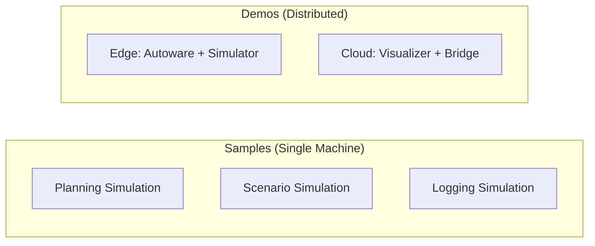

# Deployment

A **deployment** is a running instance of Open AD Kit — a specific combination of Autoware components configured to achieve a particular task, such as a simulation or a full autonomous driving stack.

Deployments are defined using container orchestration files (typically `docker-compose.yaml`), making them portable and reproducible across environments from a developer's laptop to production edge devices.

## Deployment Types

:material-test-tube:{ .oak-card-icon }

<h3>Samples</h3>

Self-contained, single-machine deployments for learning and development. Each sample demonstrates a specific Autoware workflow with minimal setup.

<a href="samples/" class="md-button">Explore Samples</a>

:material-lan-connect:{ .oak-card-icon }

<h3>Demos</h3>

Multi-machine and distributed deployments that demonstrate advanced use cases such as cloud-edge bridging and remote visualization.

<a href="demos/" class="md-button">Explore Demos</a>

## Choosing a Deployment

| Deployment | Type | Purpose | Complexity |
|-----------|------|---------|------------|
| [Planning Simulation](samples/planning-simulation/index.md) | Sample | Run Autoware planning stack with a sample map | Single machine |
| [Scenario Simulation](samples/scenario-simulation/index.md) | Sample | Execute predefined scenarios with TIER IV Scenario Simulator | Single machine |
| [Logging Simulation](samples/logging-simulation/index.md) | Sample | Replay recorded sensor data (rosbag) through the AD stack | Single machine |
| [Zenoh Bridge](demos/zenoh-bridge/index.md) | Demo | Distributed cloud-edge visualization with ROS 2 bridging | Multi-machine |

## Architecture

All deployments share a common pattern:

1. **Component images** are pulled from the GitHub Container Registry
2. **Environment files** (`.env`) configure runtime parameters
3. **Docker Compose** orchestrates containers on a single host
4. **Optional: Zenoh bridge** connects distributed ROS 2 domains for remote operation

## Next Steps

- [Run your first sample deployment](samples/planning-simulation/index.md)
- [Learn about Open AD Kit components](../components/index.md)
- [Understand container image tags](../getting-started/image-tags.md)
