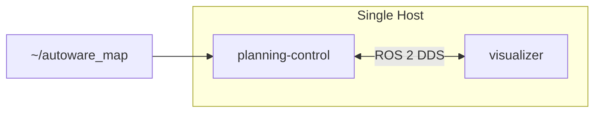

# Planning Simulation

!!! abstract ""
    The Planning Simulation sample demonstrates the Open AD Kit planning simulation workflow. It runs the Autoware planning and control stack against a pre-recorded point cloud map, allowing you to set a goal pose and observe the vehicle plan and follow a trajectory in a virtual environment.

## What You Will See

After starting the deployment, you will access a noVNC-based RViz2 visualizer in your browser. From there you can:

- Set an initial pose for the ego vehicle
- Set a goal pose on the map
- Observe the planned trajectory, behavior planning, and control outputs in real time
- Monitor the vehicle as it follows the planned path

## Requirements

- Docker Engine (set up via `setup.sh`, below)
- Planning simulation sample map (downloaded below)

!!! tip "GPU"
    A GPU is optional for this deployment. The planning and control components run efficiently on CPU.

## Before You Start

No `git clone` required — set up Docker, then download the self-contained deployment bundle and its sample map.

### 1. Set up the environment (one-time)

```bash
{{ setup_command }}
```

### 2. Download the deployment bundle

```bash
curl -fL https://github.com/autowarefoundation/openadkit/releases/latest/download/planning-simulation.tar.gz | tar xz
cd planning-simulation
```

!!! note "Releases"
    Deployment bundles ship as assets on each [GitHub Release](https://github.com/autowarefoundation/openadkit/releases). Until the first official release is published, developers can use the `deployments/planning-simulation/` folder from a cloned repository instead.

### 3. Download the sample map

```bash
./fetch-sample-data.sh planning-simulation
```

!!! info "About this map"
    This sample map (Copyright 2020 TIER IV, Inc.) is provided for demonstration purposes only. For production use, follow the [Autoware map creation guide](https://autowarefoundation.github.io/autoware-documentation/main/how-to-guides/integrating-autoware/creating-maps/).

## Start the Deployment

From the `planning-simulation` directory, start the containers:

```bash
docker compose --env-file planning-simulation.env up -d
```

Wait approximately 10 seconds for the containers to initialize.

## Access the Visualizer

Open your browser and navigate to:

```text
http://localhost:6080/vnc.html
```

Use the default password **`openadkit`** to access the visualizer. The RViz2 interface may take a few additional seconds to fully load.

--8<-- "includes/visualizer-remote-access.md"

## Run the Simulation

Once the visualizer is open, follow the [Autoware planning simulation instructions](https://autowarefoundation.github.io/autoware-documentation/main/demos/planning-sim/lane-driving/#2-set-an-initial-pose-for-the-ego-vehicle) to:

1. Set an **initial pose** for the ego vehicle
2. Set a **goal pose** on the map
3. Observe the vehicle autonomously plan and execute the route

## Stop the Deployment

```bash
docker compose --env-file planning-simulation.env down
```

## Troubleshooting

| Issue | Solution |
|-------|----------|
| Blank visualizer screen | Wait 10-30 seconds for containers to fully initialize, then refresh the browser |
| `file not found` error | Re-run `./fetch-sample-data.sh planning-simulation` to (re)download the map into `~/autoware_map` |
| Port 6080 in use | Stop the conflicting service (host networking binds `:6080` directly; `ports:` mappings are ignored) |
| Vehicle does not move after setting goal | Check that the initial pose is set correctly and the map is loaded in RViz2 |

## Architecture



## Related

- [Scenario Simulation](../scenario-simulation/index.md) — Test with predefined traffic scenarios
- [Logging Simulation](../logging-simulation/index.md) — Replay recorded sensor data
- [Components Overview](../../components/index.md) — Learn about the planning and control stack
