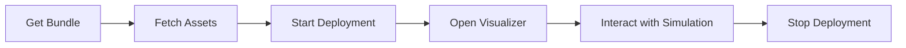

# Samples

Sample deployments are self-contained configurations designed for **learning, development, and local testing**. Each sample demonstrates a specific Autoware workflow and can be started on a single machine with minimal setup.

## Available Samples

:material-map-marker-path:{ .oak-card-icon }

<h3>Planning Simulation</h3>

Run the Autoware planning stack against a pre-recorded point cloud map. Set a goal pose and watch the vehicle plan and follow a trajectory in a virtual environment.

Single Machine GPU Optional

<a href="planning-simulation/" class="md-button">Run Planning Simulation</a>

:material-file-document-outline:{ .oak-card-icon }

<h3>Scenario Simulation</h3>

Execute predefined traffic scenarios using the official TIER IV Scenario Simulator container. Validate planning and behavior under specific conditions.

Single Machine GPU Optional

<a href="scenario-simulation/" class="md-button">Run Scenario Simulation</a>

:material-play-circle-outline:{ .oak-card-icon }

<h3>Logging Simulation</h3>

Replay recorded sensor data (rosbag) through the full Autoware stack. Test perception, localization, and planning against real-world logged data.

Single Machine GPU Recommended

<a href="logging-simulation/" class="md-button">Run Logging Simulation</a>

:material-car-sports:{ .oak-card-icon }

<h3>CARLA Simulation</h3>

Closed-loop end-to-end simulation with the CARLA 0.9.16 simulator. The full Autoware stack perceives and drives a CARLA ego vehicle in a photorealistic world.

Single Machine GPU Required

<a href="carla-simulation/" class="md-button">Run CARLA Simulation</a>

## Before You Start

All sample deployments require:

1. **Docker Engine** installed and running (set up via `setup.sh`)
2. **NVIDIA Container Toolkit** (optional but recommended for GPU acceleration)
3. **Autoware Data** — perception model weights and sample sensor data. Download with `setup.sh --download-artifacts` (required for logging-simulation; optional for planning/scenario simulation)

No `git clone` is needed — each sample is downloaded as a self-contained bundle from the [latest release](https://github.com/autowarefoundation/openadkit/releases/latest).

!!! tip "GPU Recommendation"
    While planning and scenario simulations can run on CPU-only machines, the logging simulation benefits significantly from a GPU for sensing and perception tasks.

## Common Workflow

- **Set up the environment** — `curl -fsSL …/setup.sh | sudo bash` (one-time)
- **Get the deployment** — Download and extract the sample's `<sample>.tar.gz` bundle, then `cd <sample>`
- **Download assets** — `./fetch-sample-data.sh <sample>` (maps/rosbags as required)
- **Configure environment** — Edit the `.env` file for your setup (optional)
- **Start the deployment** — Run `docker compose --env-file <sample>.env up -d`
- **Open the visualizer** — Access RViz via noVNC at `http://localhost:6080/vnc.html`
- **Interact with the simulation** — Set poses, launch scenarios, or play rosbags
- **Stop the deployment** — Run `docker compose --env-file <sample>.env down`

## Troubleshooting

| Issue | Likely Cause | Solution |
|-------|--------------|----------|
| Visualizer shows blank screen | Containers still initializing | Wait 10-30 seconds and refresh |
| `file not found` on startup | Map or rosbag not downloaded | Run `./fetch-sample-data.sh <sample>` |
| Port already in use | Another service on 6080 | Change the port mapping in `docker-compose.yaml` |
| Poor performance | No GPU acceleration | Install NVIDIA Container Toolkit or reduce workload |

