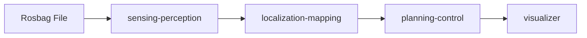

# Logging Simulation

!!! abstract ""
    The Logging Simulation sample replays recorded sensor data (a rosbag) through the full Autoware stack. It is the most realistic single-machine simulation, testing perception, localization, and planning against actual real-world logged data.

## What You Will See

After starting the deployment and playing the rosbag, you will observe the Autoware stack processing real recorded sensor data:

- Perception outputs (detected objects, lane boundaries) overlaid on the recorded scene
- Localization estimates as the vehicle traverses the logged route
- Planning and control outputs responding to the replayed environment
- Full RViz visualization via the noVNC browser interface

## Requirements

- Docker Engine (set up via `setup.sh`, below)
- NVIDIA Container Toolkit **highly recommended** (for GPU-accelerated sensing and perception)
- Logging simulation sample map and rosbag (downloaded below)
- Autoware artifacts (downloaded via `setup.sh`)

!!! warning "GPU Strongly Recommended"
    This sample runs the full sensing and perception pipeline. Without a GPU, performance will be significantly degraded. An NVIDIA GPU with 4 GB+ VRAM is strongly recommended.

## Before You Start

No `git clone` required.

### 1. Set up the environment + download Autoware artifacts (one-time)

```bash
curl -fsSL https://raw.githubusercontent.com/autowarefoundation/openadkit/main/setup.sh | sudo bash -s -- --download-artifacts
```

This installs Docker / the NVIDIA Container Toolkit and downloads the perception artifacts into `${HOME}/autoware_data` (mounted into the sensing and perception containers).

### 2. Download the deployment bundle

```bash
curl -fL https://github.com/autowarefoundation/openadkit/releases/latest/download/logging-simulation.tar.gz | tar xz
cd logging-simulation
```

!!! note "Releases"
    Deployment bundles ship as assets on each [GitHub Release](https://github.com/autowarefoundation/openadkit/releases). Until the first official release is published, developers can use the `deployments/samples/logging-simulation/` folder from a cloned repository instead.

### 3. Download the sample map and rosbag

```bash
./fetch-sample-data.sh logging-simulation
```

!!! info "About the rosbag"
    This sample rosbag (Copyright 2020 TIER IV, Inc.) is provided for demonstration. Due to privacy concerns, it does **not** contain image data. This means:

    - **Traffic light recognition** cannot be tested with this sample
    - **Object detection accuracy** is decreased compared to full camera data

## Start the Deployment

From the `logging-simulation` directory, start the base containers:

```bash
docker compose --env-file logging-simulation.env up -d
```

Wait approximately 10 seconds for the containers to initialize.

!!! tip "GPU acceleration (recommended)"
    To run sensing and perception on an NVIDIA GPU, layer the GPU compose overlay and its env file on top of the base ones (both `--env-file` flags apply, the later overriding the former):

    ```bash
    docker compose -f docker-compose.yaml -f docker-compose.gpu.yaml \
      --env-file logging-simulation.env --env-file logging-simulation.gpu.env up -d
    ```

    This swaps in the `sensing-perception-cuda` image and reserves the GPU for the `sensing` and `perception` services. It requires the NVIDIA Container Toolkit (installed by `setup.sh` by default).

## Access the Visualizer

Open your browser and navigate to:

```text
http://localhost:6080/vnc.html
```

Use the default password **`openadkit`**. If running on a remote server, use the server's IP address.

## Start the Rosbag Playback

To begin replaying the recorded sensor data, start the rosbag container:

```bash
docker compose --env-file logging-simulation.env up rosbag -d
```

Watch the RViz display as Autoware processes the replayed data in real time.

## Stop the Deployment

To stop all containers including the rosbag profile:

```bash
docker compose --env-file logging-simulation.env --profile rosbag down
```

## Troubleshooting

| Issue | Solution |
|-------|----------|
| Containers fail to start | Verify `~/autoware_data` exists and contains the downloaded artifacts |
| `file not found` for map/rosbag | Re-run `./fetch-sample-data.sh logging-simulation` to (re)download into `~/autoware_map` |
| Very slow perception | GPU not available. Install NVIDIA Container Toolkit or reduce workload |
| Visualizer blank | Wait 10-30 seconds for containers to initialize, then refresh |
| No objects detected | The rosbag lacks image data. This is expected for the sample rosbag. |

## Known Limitations

The `rosbag` service in this deployment uses the upstream `ghcr.io/autowarefoundation/autoware:universe` image rather than an Open AD Kit component image. This is a temporary measure while Open AD Kit migrates from monolithic to component-based architecture. An OAK component image for rosbag playback will be available in a future release.

## Related

- [Planning Simulation](../planning-simulation/index.md) — Simpler planning-focused simulation
- [Scenario Simulation](../scenario-simulation/index.md) — Predefined scenario testing
- [Components Overview](../../../components/index.md) — Learn about the sensing and perception stack
- [Getting Started](../../../getting-started/index.md) — Environment setup and artifact download


