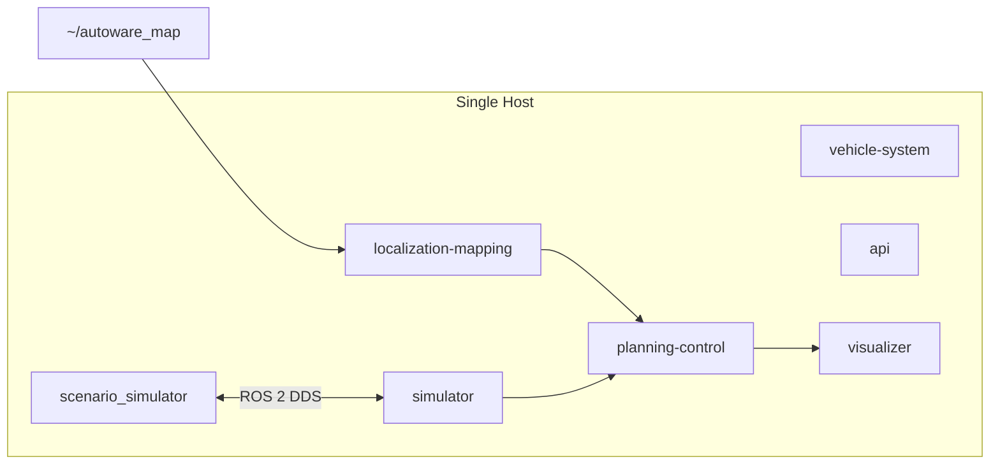

# Scenario Simulation

!!! abstract ""
    The Scenario Simulation deployment runs the Autoware stack alongside the official [TIER IV Scenario Simulator](https://github.com/tier4/scenario_simulator_v2) container. It enables you to execute predefined traffic scenarios to validate planning and behavior under specific conditions — ideal for CI pipelines and regression testing.

## What You Will See

After starting the deployment, the scenario simulator generates a virtual traffic environment around the ego vehicle. You can:

- Watch the ego vehicle navigate predefined scenarios in the noVNC visualizer
- Observe behavior planning decisions (lane changes, intersection handling, obstacle avoidance)
- Review simulation results and metrics after scenario completion
- Define and run your own custom scenarios

## Prerequisites

- Docker Engine (set up via `install.sh`, below)

!!! warning "Use the Correct Map"
    Do **not** use the `sample-map-planning` map with this deployment. The Kashiwanoha map is required. Using a different map will cause `setMap() for invalid version map`, missing route/localization, and repeated MRM transitions.

## Before You Start

No `git clone` required.

### 1. Set up the environment (one-time)

```bash
{{ install_command }}
```

### 2. Download the deployment bundle

```bash
curl -fL https://github.com/autowarefoundation/openadkit/releases/latest/download/scenario-simulation.tar.gz | tar xz
cd scenario-simulation
```

!!! note "Releases"
    Deployment bundles ship as assets on each [GitHub Release](https://github.com/autowarefoundation/openadkit/releases). Until the first official release is published, developers can use the `deployments/scenario-simulation/` folder from a cloned repository instead; from that folder, run `../../install.sh sample-data scenario-simulation` to fetch the map.

### 3. Download the Kashiwanoha map

```bash
./install.sh sample-data scenario-simulation
```

## Configuration

Edit `scenario-simulation.env` to customize the deployment:

| Variable | Description | Default |
|----------|-------------|---------|
| `SCENARIO_SIMULATION` | Enable scenario simulator mode | `true` |
| `SCENARIO` | Scenario file path inside the container | (bundled example) |
| `SCENARIO_HOST_DIR` | Host directory mounted at `/scenarios` | `./scenarios/` |
| `OUTPUT_HOST_PATH` | Host directory for simulation results | `./output/` |
| `OUTPUT_DIRECTORY` | Container path for simulation results | — |
| `SCENARIO_SIMULATOR_IMAGE` | TIER IV scenario simulator image tag | (pinned in `.env`) |
| `SCENARIO_READY_TIMEOUT` | Max seconds to wait for Autoware readiness | 300 |
| `MAP_PATH` | Host map directory mounted into containers | `~/autoware_map/kashiwanoha_map` |

### Custom Scenarios

To run your own scenario:

1. Place your scenario YAML files under the `SCENARIO_HOST_DIR` (default: `./scenarios/`)
2. Set the scenario path in the environment file:

   ```bash
   SCENARIO=/scenarios/my-scenario.yaml
   ```

3. Simulation results are saved to `OUTPUT_HOST_PATH` (default: `./output/`)

!!! tip "Custom Maps"
    Custom scenarios must use the Kashiwanoha map unless you also provide a matching host map. For a different map, update `MAP_PATH`, `LANELET2_MAP_FILE`, and `POINTCLOUD_MAP_FILE`, and ensure the files exist under `MAP_PATH` before starting.

## Start the Deployment

From the `scenario-simulation` directory, start the containers:

```bash
docker compose --env-file scenario-simulation.env up -d
```

!!! warning "Cloned repository"
    If running from a cloned repository rather than a release bundle, pass both env files:
    `docker compose --env-file ../base/base.env --env-file scenario-simulation.env up -d`

Wait approximately **90 seconds** for Autoware and the scenario simulator to initialize. The scenario runner waits up to `SCENARIO_READY_TIMEOUT` seconds for required Autoware map and API endpoints before launching.

--8<-- "includes/visualizer-remote-access.md"

## Stop the Deployment

```bash
docker compose --env-file scenario-simulation.env down
```

## Expected Behavior

- Autoware containers initialize and load the mounted Kashiwanoha map
- The scenario simulator container starts and waits for Autoware readiness
- Once ready, the scenario executes automatically
- Results are written to the configured output directory

## Troubleshooting

| Issue | Solution |
|-------|----------|
| Scenario does not start | Ensure the map was fetched: re-run `./install.sh sample-data scenario-simulation --force` |
| `setMap() for invalid version map` | You are using the wrong map. Ensure Kashiwanoha is extracted, not `sample-map-planning` |
| Visualizer blank | Wait up to 90 seconds for full initialization; containers depend on each other sequentially |
| Missing results | Verify `OUTPUT_HOST_PATH` exists and is writable |

## Architecture



## Related

- [Scenario test simulation](https://autowarefoundation.github.io/autoware-documentation/main/demos/scenario-simulation/scenario-simulator/scenario-test-simulation/) — Official Autoware scenario simulation guide
- [Planning Simulation](../planning-simulation/index.md) — Simpler single-map simulation
- [Logging Simulation](../logging-simulation/index.md) — Replay recorded sensor data
