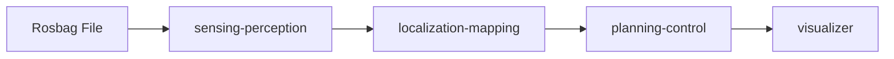

# Logging Simulation

!!! abstract ""
    The Logging Simulation sample replays recorded sensor data (a rosbag) through the full Autoware stack. It is the most realistic single-machine simulation, testing perception, localization, and planning against actual real-world logged data.

## What You Will See

After starting the deployment and playing the rosbag, you will observe the Autoware stack processing real recorded sensor data:

- Perception outputs (detected objects, lane boundaries) overlaid on the recorded scene
- Localization estimates as the vehicle traverses the logged route
- Planning and control outputs responding to the replayed environment
- Full RViz visualization via the noVNC browser interface

## Requirements

- Docker Engine
- Open AD Kit repository cloned and environment set up
- NVIDIA Container Toolkit **highly recommended** (for GPU-accelerated sensing and perception)
- Logging simulation sample map and rosbag (downloaded below)
- Autoware artifacts (downloaded via `setup.sh`)

!!! warning "GPU Strongly Recommended"
    This sample runs the full sensing and perception pipeline. Without a GPU, performance will be significantly degraded. An NVIDIA GPU with 4 GB+ VRAM is strongly recommended.

## Before You Start

### 1. Install Prerequisites

```bash
sudo apt-get install -y python3-pip unzip
python3 -m pip install --user gdown
```

### 2. Download Autoware Artifacts

The logging simulation mounts `${HOME}/autoware_data` into the sensing and perception containers. Download the artifacts first:

```bash
cd /path/to/openadkit
sudo ./setup.sh --download-artifacts
```

### 3. Download the Sample Map

```bash
mkdir -p ~/autoware_map
gdown -O ~/autoware_map/sample-map-rosbag.zip 'https://docs.google.com/uc?export=download&id=1A-8BvYRX3DhSzkAnOcGWFw5T30xTlwZI'
unzip -o -d ~/autoware_map ~/autoware_map/sample-map-rosbag.zip
```

### 4. Download the Sample Rosbag

```bash
gdown -O ~/autoware_map/sample-rosbag.zip 'https://docs.google.com/uc?export=download&id=1sU5wbxlXAfHIksuHjP3PyI2UVED8lZkP'
unzip -o -d ~/autoware_map ~/autoware_map/sample-rosbag.zip
```

!!! info "About the rosbag"
    This sample rosbag (Copyright 2020 TIER IV, Inc.) is provided for demonstration. Due to privacy concerns, it does **not** contain image data. This means:

    - **Traffic light recognition** cannot be tested with this sample
    - **Object detection accuracy** is decreased compared to full camera data

## Start the Deployment

Navigate to the deployment directory and start the base containers:

```bash
cd deployments/samples/logging-simulation
docker compose --env-file logging-simulation.env up -d
```

Wait approximately 10 seconds for the containers to initialize.

## Access the Visualizer

Open your browser and navigate to:

```
http://localhost:6080/vnc.html
```

Use the default password **`openadkit`**. If running on a remote server, use the server's IP address.

## Start the Rosbag Playback

To begin replaying the recorded sensor data, start the rosbag container:

```bash
docker compose --env-file logging-simulation.env up rosbag -d
```

Watch the RViz display as Autoware processes the replayed data in real time.

## Stop the Deployment

To stop all containers including the rosbag profile:

```bash
docker compose --env-file logging-simulation.env --profile rosbag down
```

## Troubleshooting

| Issue | Solution |
|-------|----------|
| Containers fail to start | Verify `~/autoware_data` exists and contains the downloaded artifacts |
| `file not found` for map/rosbag | Ensure both zip files were downloaded and extracted to `~/autoware_map` |
| Very slow perception | GPU not available. Install NVIDIA Container Toolkit or reduce workload |
| Visualizer blank | Wait 10-30 seconds for containers to initialize, then refresh |
| No objects detected | The rosbag lacks image data. This is expected for the sample rosbag. |

## Related

- [Planning Simulation](../planning-simulation/index.md) — Simpler planning-focused simulation
- [Scenario Simulation](../scenario-simulation/index.md) — Predefined scenario testing
- [Components Overview](../../../components/index.md) — Learn about the sensing and perception stack
- [Getting Started](../../../getting-started/index.md) — Environment setup and artifact download


