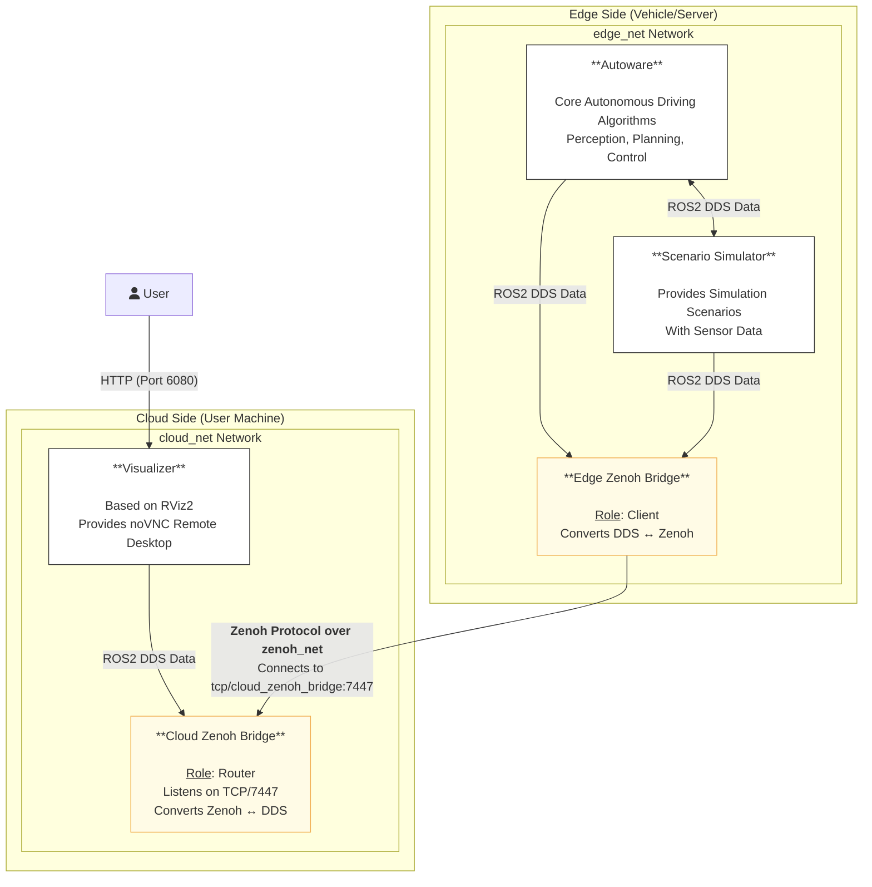

# OpenADKit Remote Visualization with Zenoh Bridge: Implementation Report and User Manual

## 1. Introduction

This document provides a comprehensive implementation guide and technical overview for the distributed architecture of the OpenADKit project. The core objective is to separate compute-intensive and lightweight components of an autonomous driving system, enabling deployment across different hardware. For example, the core Autoware software stack runs on the edge side (e.g., vehicle, or a powerful simulation server). Users can remotely visualize and manage Autoware from their laptops or a cloud-based management system.

To achieve this, we utilize [Zenoh](https://zenoh.io/) as a high-performance, low-latency communication protocol, paired with the [`zenoh-bridge-ros2dds`](https://github.com/eclipse-zenoh/zenoh-plugin-ros2dds) tool to seamlessly connect two ROS 2 (Robot Operating System 2) environments isolated by Docker virtual networks. This manual covers architecture design, setup steps, system startup, and troubleshooting, providing complete operational guidance.

## 2. Detailed Architecture Design

### 2.1. Core Concept: Edge-Cloud Model

The system decouples the previously monolithic architecture into an edge-cloud model:

- **Edge Side**: Includes components with high computational demands (especially CPU and GPU).
  - `autoware`: Core perception, decision-making, and planning modules.
  - `scenario_simulator`: Generates virtual traffic environments and provides simulated sensor data for Autoware.
  - **Deployment**: Typically on vehicles or powerful edge machine.

- **Cloud Side**: Includes lightweight components critical for user interaction and visualization.
  - `visualizer`: Based on RViz2, encapsulated with noVNC, allowing users to access the visualization interface via any modern web browser without installing ROS 2 or RViz locally.
  - **Deployment**: Typically on a user's laptop or a cloud-based management system, where low computational power is sufficient.

### 2.2. Architecture Diagram

The following Mermaid diagram illustrates the components, networks, and data flow paths.



### 2.3. Network Isolation and Communication Bridge

- **Network Design**:
  - `edge_net`: An isolated virtual network for `autoware` and `scenario_simulator`, using ROS 2 DDS multicast for low-latency communication.
  - `cloud_net`: An isolated network for `visualizer`, simulating physical or logical separation from the server.
  - TCP/IP (use `zenoh_net` docker network in this demo for simplicity): The network that is possible to connect `edge_zenoh_bridge` and `cloud_zenoh_bridge`, ensuring a clean cross-domain data transmission path.

- **Communication Core: Zenoh Bridge**:
  - `cloud_zenoh_bridge` (`zenoh-bridge-ros2dds` container): Acts as a **Router**, listening for client connections on TCP port `7447`. It receives Zenoh data from the edge and converts it to ROS 2 DDS for the `visualizer`.
  - `edge_zenoh_bridge` (`zenoh-bridge-ros2dds` container): Acts as a **Client**, connecting to the `cloud_zenoh_bridge` via `zenoh_net`. It scans for ROS 2 topics in `edge_net`, converts them to the Zenoh protocol, and forwards them to the router.
  - `config/zenoh-bridge-ros2dds.json5`: A configuration file defining the bridge's mode, listening endpoints, and topic filtering rules, allowing precise control over transmitted data to optimize bandwidth.

## 3. User Manual

### 3.1. Prerequisites

Ensure the following software is installed:
1. **Docker Engine**: See [Docker Installation Guide](https://docs.docker.com/engine/install/).
2. **Docker Compose**: Usually included with Docker Desktop; otherwise, see [Docker Compose Installation Guide](https://docs.docker.com/compose/install/).
3. **Git**: For cloning the project.
4. A stable internet connection for pulling Docker images.

### 3.2. Installation and Setup

1. **Clone the Project**:
   Execute the following commands in a terminal:
   ```bash
   git clone https://github.com/autowarefoundation/openadkit
   cd openadkit
   ```

2. **Verify Directory Structure**:
   Ensure the project includes:
   ```
   .
   ├── README.md
   ├── docker-compose.yaml
   └── config/
       └── zenoh-bridge-ros2dds.json5
   ```
   Modify `zenoh-bridge-ros2dds.json5` as needed to filter topics.

### 3.3. Starting the System

1. **Launch All Workloads**:
   In the project root directory, run:
   ```bash
   docker-compose up -d
   ```
   - `-d` runs containers in the background.
   - The first launch may take several minutes to download the required Docker images.

2. **Monitor Startup Logs (Optional)**:
   To view the real-time logs from all workloads, run:
   ```bash
   docker-compose logs -f
   ```

### 3.4. Verification and Usage

1. **Check Container Status**:
   Run `docker ps` or `docker-compose ps` to ensure all containers are running:
   - `autoware`
   - `scenario_simulator`
   - `visualizer`
   - `edge_zenoh_bridge`
   - `cloud_zenoh_bridge`

2. **Access noVNC Visualization Interface**:
   Open a web browser and navigate to:
   ```
   http://localhost:6080
   ```
   Use the default password `openadkit`.

3. **Verify Operation**:
   - The noVNC interface should display the RViz2 visualization tool.
   - If the `Global Status` in the RViz2 "Displays" panel shows `OK` (green text), the system is running correctly. You should see maps, the vehicle model, and other simulated objects.
   - If it shows `Warning`, please refer to the troubleshooting section below.

4. **Stop the System**:
    To stop and remove all containers and networks, run:
   ```bash
   docker-compose down -v
   ```
   - The `-v` flag also removes the `autoware_map` volume. Omit it if you wish to preserve the downloaded map data for future use.

## 4. Troubleshooting

### Issue 1: Visualizer Shows "Global Status: Warning" or a Blank Screen

- **Cause**: This can be a race condition where ROS 2 nodes in one container start before the Zenoh bridge connection is fully established, preventing topics from being discovered correctly. The `depends_on` option in `docker-compose.yaml` helps, but doesn't guarantee workload readiness.
- **Solutions**:
  1. **Restart Workloads**: A simple restart often resolves timing issues.
     ```bash
     docker-compose restart
     ```
  2. **Staged Startup**: Manually start the core workloads first, wait a moment, then start the compute-heavy workloads.
     ```bash
     # Start the cloud side and the bridges
     docker-compose up -d cloud_zenoh_bridge edge_zenoh_bridge visualizer
     # Wait for them to initialize
     sleep 15
     # Start the edge side
     docker-compose up -d autoware scenario_simulator
     ```

### Issue 2: Port Conflict (Port is already allocated)

- **Cause**: Ports `6080` or `7447` are in use by another program.
- **Solution**:
  - Stop the program using the port.
  - Or modify `docker-compose.yaml`, e.g., change `6080:6080` to `8080:6080`, and access via `http://localhost:8080`.

### Issue 3: Container Fails to Start with `file not found` or Permission Issues

- **Cause**: The `config/zenoh-bridge-ros2dds.json5` file is missing or inaccessible.
- **Solution**:
  - Verify the `config` directory and file exist.
  - On Linux/macOS, check file permissions to ensure Docker can read them.