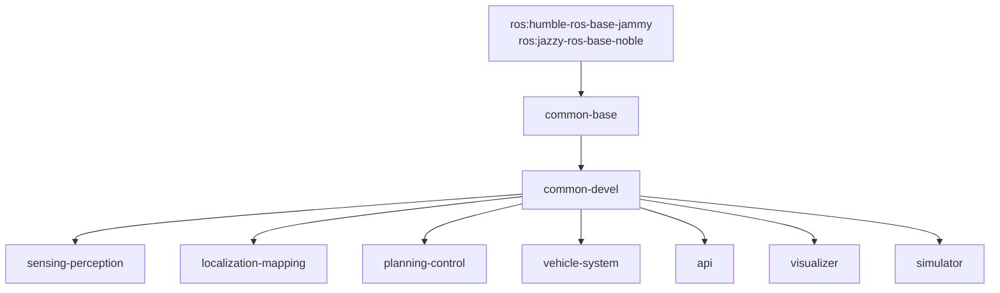

# Build from Source

This guide covers building Open AD Kit container images locally from the repository source.

!!! note "Who needs this"
    Building from source is for **maintainers and contributors**. Typical users should pull the pre-built images from GHCR — see [Container Image Tags](../getting-started/image-tags.md).

## Prerequisites

- Docker Engine with [Buildx](https://docs.docker.com/build/architecture/#buildx) (bundled with current Docker Engine)
- Git
- Sufficient disk space — the full build set is large (multiple multi-gigabyte images)

## Build System

Images are built with [Docker Bake](https://docs.docker.com/build/bake/). All targets are defined in [`components/docker-bake.hcl`](https://github.com/autowarefoundation/openadkit/blob/main/components/docker-bake.hcl), which is also the file CI uses (`build-all-images.yaml`).

The build is staged: base images build first, component images build *from* them.



### Build Groups

| Group | Targets | Published To |
|-------|---------|--------------|
| `common` | `common-base`, `common-devel` (+ `-cuda` variants) | `ghcr.io/autowarefoundation/openadkit-common` |
| `component` | `sensing-perception`, `localization-mapping`, `planning-control`, `vehicle-system`, `api`, `visualizer`, `simulator` (+ `sensing-perception-cuda`) | `ghcr.io/autowarefoundation/openadkit` |

## Building

Use the repository's [`build.sh`](https://github.com/autowarefoundation/openadkit/blob/main/build.sh) wrapper — it checks out the Autoware source tree (`git clone` + `vcs import` of `autoware.repos`) and then invokes Docker Bake with the right build context, base image, and tags. Building Bake directly will not work without that source tree (see the note below).

```bash
# Clone the repository
git clone https://github.com/autowarefoundation/openadkit.git
cd openadkit

# Build the component images (default target)
./build.sh

# Build only the common base/devel images
./build.sh --target common
```

| Flag | Description | Default |
|------|-------------|---------|
| `--target` | `common` or `components` | `components` |
| `--ros-distro` | `humble` or `jazzy` | `humble` |
| `--platform` | `linux/amd64` or `linux/arm64` | `linux/amd64` (or `linux/arm64` on aarch64) |
| `--no-cuda` | Skip building the CUDA images | CUDA enabled |

```bash
# Build for ROS 2 Jazzy, amd64, without CUDA
./build.sh --ros-distro jazzy --platform linux/amd64 --no-cuda
```

!!! note "Why a wrapper instead of raw `docker buildx bake`"
    The component Dockerfiles bind-mount parts of the Autoware source tree (`autoware/src/...`), so the source must be present before building. `build.sh` handles the `git clone` + `vcs import`, sets the Bake `context`, `BASE_IMAGE`, and image tags, and builds the `common` images before the `component` images (which build `FROM` them). The `docker-bake.hcl` targets themselves carry no context/tags defaults — CI supplies those the same way `build.sh` does.

## Continuous Integration

CI builds every target automatically via [`.github/workflows/build-all-images.yaml`](https://github.com/autowarefoundation/openadkit/blob/main/.github/workflows/build-all-images.yaml), which invokes the same Bake file across a build matrix. The matrix (targets, platforms, ROS distros) is driven by [`.github/image-inventory.json`](https://github.com/autowarefoundation/openadkit/blob/main/.github/image-inventory.json) — the source of truth for what gets built and on which architectures.

## Related

- [Contributing](contributing.md) — How to submit your changes
- [Components](../components/index.md) — What each image contains
- [Container Image Tags](../getting-started/image-tags.md) — Pulling pre-built images
