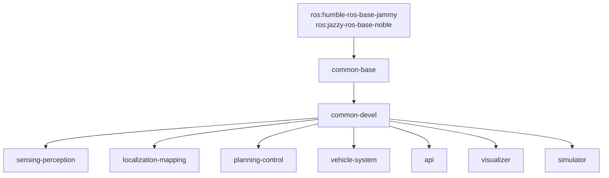

# Build from Source

This guide covers building Open AD Kit container images locally from the repository source.

!!! note "Who needs this"
    Building from source is for **maintainers and contributors**. Typical users should pull the pre-built images from GHCR — see [Container Image Tags](../getting-started/image-tags.md).

## Prerequisites

- Docker Engine with [Buildx](https://docs.docker.com/build/architecture/#buildx) (bundled with current Docker Engine)
- Git
- Sufficient disk space — the full build set is large (multiple multi-gigabyte images)

## Build System

Images are built with [Docker Bake](https://docs.docker.com/build/bake/). All targets are defined in [`components/docker-bake.hcl`](https://github.com/autowarefoundation/openadkit/blob/main/components/docker-bake.hcl), which is also the file CI uses (`build-all-images.yaml`).

The build is staged: base images build first, component images build *from* them.



### Build Groups

| Group | Targets | Published To |
|-------|---------|--------------|
| `common` | `common-base`, `common-devel` (+ `-cuda` variants) | `ghcr.io/autowarefoundation/openadkit-common` |
| `component` | `sensing-perception`, `localization-mapping`, `planning-control`, `vehicle-system`, `api`, `visualizer`, `simulator` (+ `sensing-perception-cuda`) | `ghcr.io/autowarefoundation/openadkit` |

## Building

```bash
# Clone the repository
git clone https://github.com/autowarefoundation/openadkit.git
cd openadkit

# Build everything (default group = common + component)
docker buildx bake -f components/docker-bake.hcl

# Build a single group
docker buildx bake -f components/docker-bake.hcl common
docker buildx bake -f components/docker-bake.hcl component

# Build a single target
docker buildx bake -f components/docker-bake.hcl planning-control
```

!!! note "Component images depend on common images"
    Component targets build `FROM` the common images (via the `COMMON_BASE_IMAGE` / `COMMON_DEVEL_IMAGE` build args, which default to `ghcr.io/autowarefoundation/openadkit-common`). Either build the `common` group first, or let the default group build both. To use locally built common images, override those args with `--set`.

## Customization

Build variables are Dockerfile `ARG`s and are overridden through Bake's `--set` flag, scoped per target (`*.args.<NAME>`):

| Variable | Description | Default |
|----------|-------------|---------|
| `ROS_DISTRO` | ROS 2 distribution | `humble` |
| `BASE_IMAGE` | Base ROS image | `ros:humble-ros-base-jammy` |

```bash
# Build for ROS 2 Jazzy instead of Humble
docker buildx bake -f components/docker-bake.hcl \
  --set '*.args.ROS_DISTRO=jazzy' \
  --set '*.args.BASE_IMAGE=ros:jazzy-ros-base-noble'
```

## Continuous Integration

CI builds every target automatically via [`.github/workflows/build-all-images.yaml`](https://github.com/autowarefoundation/openadkit/blob/main/.github/workflows/build-all-images.yaml), which invokes the same Bake file across a build matrix. The matrix (targets, platforms, ROS distros) is driven by [`.github/image-inventory.json`](https://github.com/autowarefoundation/openadkit/blob/main/.github/image-inventory.json) — the source of truth for what gets built and on which architectures.

## Related

- [Contributing](contributing.md) — How to submit your changes
- [Components](../components/index.md) — What each image contains
- [Container Image Tags](../getting-started/image-tags.md) — Pulling pre-built images
