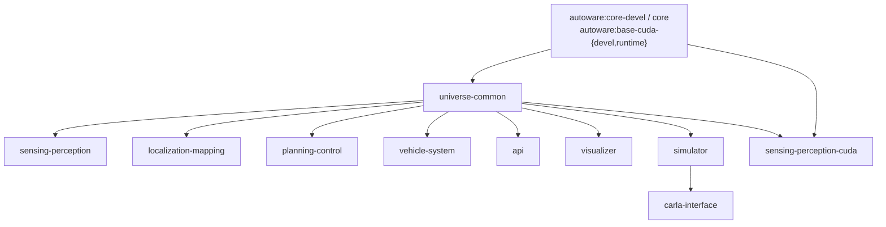

# Build from Source

This guide covers building Open AD Kit container images locally from the repository source.

!!! note "Who needs this"
    Building from source is for **maintainers and contributors**. Typical users should pull the pre-built images from GHCR — see [Container Image Tags](../getting-started/image-tags.md).

## Prerequisites

- Docker Engine with [Buildx](https://docs.docker.com/build/architecture/#buildx) (bundled with current Docker Engine)
- Git (to clone this repository)
- Sufficient disk space — the full build set is large (multiple multi-gigabyte images)

You do **not** need a local Autoware source tree. Open AD Kit builds *from* the
upstream Autoware base images published on GHCR, so the only source you need is
this repository.

## Build System

Images are built with [Docker Bake](https://docs.docker.com/build/bake/). All targets are defined in [`components/docker-bake.hcl`](https://github.com/autowarefoundation/openadkit/blob/main/components/docker-bake.hcl), which is also the file CI uses (`build-all-images.yaml`).

The build is staged: the `universe-common` intermediate builds on top of the upstream Autoware images, and the component images build *from* `universe-common`.



`universe-common` is an Open AD Kit-owned thin intermediate that compiles only the
universe-common slice of Autoware on top of the upstream `core-devel`/`core`
images; everything below it (base OS, ROS, core) is owned and built by upstream.
`sensing-perception-cuda` is a parallel CUDA branch that inherits from the
upstream `base-cuda-{devel,runtime}` images and grafts in the `universe-common`
install tree.

### Build Groups

| Group | Targets | Published To |
|-------|---------|--------------|
| `universe-common` | `universe-common-devel`, `universe-common` | `ghcr.io/autowarefoundation/openadkit-common` |
| `component` | `sensing-perception`, `localization-mapping`, `planning-control`, `vehicle-system`, `api`, `visualizer`, `simulator`, `sensing-perception-cuda`, `carla-interface` | `ghcr.io/autowarefoundation/openadkit` |
| `default` | everything: `universe-common` + `component` | — |

`carla-interface` is an **amd64-only** member of the `component` group, built on top of the `simulator` image and published as `ghcr.io/autowarefoundation/openadkit:carla-interface`.

## Building

Local builds resolve cross-stage references within a single Bake graph, so you can build any group or target directly — no source checkout or wrapper script is required:

```bash
# Clone the repository
git clone https://github.com/autowarefoundation/openadkit.git
cd openadkit

# Build everything (universe-common + all components)
docker buildx bake -f components/docker-bake.hcl

# Build only the universe-common intermediate
docker buildx bake -f components/docker-bake.hcl universe-common

# Build a single component and load it into the local Docker image store
docker buildx bake -f components/docker-bake.hcl \
  --set sensing-perception.tags=openadkit:sensing-perception \
  --load \
  sensing-perception
```

The Bake file exposes a few variables, overridable via environment variables:

| Variable | Description | Default |
|----------|-------------|---------|
| `ROS_DISTRO` | `humble` or `jazzy` | `jazzy` |
| `UPSTREAM_TAG` | Pins the upstream Autoware release (e.g. `1.8.0`). Empty pulls the plain `<name>-<distro>` multi-arch tag — handy for local experiments, not for reproducible builds. | `""` |
| `UPSTREAM_REPO` | Upstream Autoware image repository | `ghcr.io/autowarefoundation/autoware` |

```bash
# Build the component group for ROS 2 Humble against a pinned upstream release
ROS_DISTRO=humble UPSTREAM_TAG=1.8.0 \
  docker buildx bake -f components/docker-bake.hcl component
```

!!! note "Tags and contexts"
    The `docker-bake.hcl` targets carry no tag or context defaults — image tags are injected by `docker/metadata-action` in CI, and you supply them locally with `--set <target>.tags=...`. Cross-stage references (`universe-common` ← components) resolve via `target:` within one local build graph; CI instead overrides each context to an already-pushed GHCR tag so groups can build in separate jobs.

## Continuous Integration

CI builds every target automatically via [`.github/workflows/build-all-images.yaml`](https://github.com/autowarefoundation/openadkit/blob/main/.github/workflows/build-all-images.yaml), which invokes the same Bake file across a build matrix. The matrix (targets, platforms, ROS distros) is driven by [`.github/image-inventory.json`](https://github.com/autowarefoundation/openadkit/blob/main/.github/image-inventory.json) — the source of truth for what gets built and on which architectures.

## Related

- [Contributing](contributing.md) — How to submit your changes
- [Components](../components/index.md) — What each image contains
- [Container Image Tags](../getting-started/image-tags.md) — Pulling pre-built images
