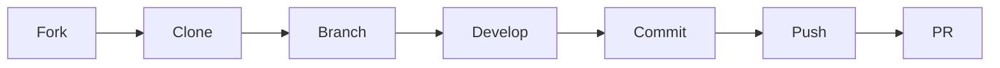

# Contributing

Thank you for your interest in contributing to Open AD Kit. This project is part of the [Autoware Foundation](https://www.autoware.org/) ecosystem, and we welcome contributions from individuals and organizations worldwide.

## License

Open AD Kit is licensed under the **Apache License 2.0**. By contributing, you agree that your contributions will be licensed under the same terms.

!!! note "No CLA Required"
    The Autoware Foundation does **not** require a Contributor License Agreement (CLA). Contributions are accepted under the Apache 2.0 license terms.

## Developer Certificate of Origin (DCO)

All commits must include a **Signed-off-by** line to certify that you have the right to submit the code under the Apache 2.0 license:

```bash
# Sign off automatically when committing
git commit -s -m "feat: add new deployment sample"
```

The sign-off is a simple line at the end of the commit message:

```text
Signed-off-by: Your Name <your.email@example.com>
```

!!! warning "DCO Enforcement"
    Pull requests without proper DCO sign-off will not be merged. The CI checks enforce this requirement automatically.

## How to Contribute

### 1. Fork the Repository

Create your own fork of the [Open AD Kit repository](https://github.com/autowarefoundation/openadkit) on GitHub.

### 2. Set Up Your Environment

```bash
# Clone your fork
git clone https://github.com/YOUR_USERNAME/openadkit.git
cd openadkit

# Add the upstream remote
git remote add upstream https://github.com/autowarefoundation/openadkit.git
```

### 3. Create a Branch

```bash
git checkout -b feat/your-feature-name
```

Use descriptive branch names that reflect the change:

- `feat/` — New features or enhancements
- `fix/` — Bug fixes
- `docs/` — Documentation improvements
- `refactor/` — Code refactoring

### 4. Make Your Changes

Follow the existing code style and documentation conventions. For documentation changes, preview them locally:

```bash
# Build the MkDocs container image (run once)
make prepare

# Serve the docs site
make serve
```

### 5. Commit with Conventional Commits

Use [Conventional Commits](https://www.conventionalcommits.org/) for all commit messages and PR titles:

| Type | Description | Example |
|------|-------------|---------|
| `feat` | New feature | `feat: add carla-interface container` |
| `fix` | Bug fix | `fix: resolve zenoh bridge port conflict` |
| `docs` | Documentation only | `docs: update hardware requirements` |
| `style` | Formatting, no code change | `style: format docker-compose files` |
| `refactor` | Code restructuring | `refactor: simplify build pipeline` |
| `test` | Adding or updating tests | `test: add scenario simulation test` |
| `chore` | Maintenance tasks | `chore: update CI workflow` |

```bash
git commit -s -m "feat: add new deployment sample for logging simulation"
```

### 6. Push and Open a Pull Request

```bash
git push origin feat/your-feature-name
```

Open a pull request against the `main` branch of the upstream repository. The PR description should include:

- **What** changed and **why**
- **How** it was tested
- Any **breaking changes** or migration notes

!!! info "Large Changes"
    For significant changes (new features, architectural modifications), please open a GitHub Discussion first to align with maintainers before submitting a PR.

## Contribution Workflow Summary

<div class="oak-steps">

- **Fork** the repository on GitHub
- **Clone** your fork and set up the development environment
- **Branch** from `main` with a descriptive name
- **Develop** your changes following project conventions
- **Commit** with DCO sign-off and Conventional Commit format
- **Push** your branch to your fork
- **Open a Pull Request** against `main` with a clear description

</div>

## Community

- [Autoware Foundation Discord](https://discord.gg/Q94UsPvReQ) — Real-time discussion and support
- [Autoware Documentation — Contributing](https://autowarefoundation.github.io/autoware-documentation/main/contributing/) — Foundation-wide contribution guidelines
- [GitHub Issues](https://github.com/autowarefoundation/openadkit/issues) — Bug reports and feature requests
- [GitHub Discussions](https://github.com/autowarefoundation/openadkit/discussions) — Design proposals and community questions

## Code of Conduct

All contributors are expected to adhere to the [Autoware Foundation Code of Conduct](https://github.com/autowarefoundation/openadkit/blob/main/CODE_OF_CONDUCT.md), which fosters an open, welcoming, and harassment-free environment.


