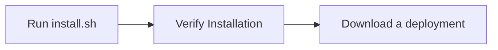

# Getting Started

This guide walks you through setting up your environment and running your first Open AD Kit deployment.



## Prerequisites

Open AD Kit runs on **Ubuntu** with Docker. The v2.0 quickstart is validated on **Ubuntu 22.04 (Jammy) and 24.04 (Noble)** with ROS 2 Humble. Install everything with the included [`install.sh`](https://github.com/autowarefoundation/openadkit/blob/main/install.sh) script instead of following separate install guides:

| Component | When you need it | How to install |
|-----------|------------------|----------------|
| **Docker Engine** | All deployments | `install.sh` (below) |
| **NVIDIA Container Toolkit** | GPU-accelerated sensing and perception | Included by default; add `--no-nvidia` to skip |
| **Autoware artifacts** | Sensing and perception samples (for example, [Logging Simulation](../deployment/logging-simulation/index.md)) | `install.sh --download-artifacts` |

## Set Up Your Environment

`install.sh` is self-contained — no `git clone` required. Run it directly:

```bash
{{ install_command }}
```

This installs Docker, the NVIDIA Container Toolkit, and other dependencies (requires sudo).

!!! tip "Skip NVIDIA Toolkit"
    Append `-s -- --no-nvidia` (i.e. `… | sudo bash -s -- --no-nvidia`) if you do not have an NVIDIA GPU. Otherwise the toolkit is **highly recommended** for sensing and perception performance.

!!! info "Autoware artifacts"
    For sensing/perception samples (e.g. [Logging Simulation](../deployment/logging-simulation/index.md)) that mount `${HOME}/autoware_data`, add `-s -- --download-artifacts`. This downloads artifacts and continues with Docker installation. For users who already have Docker and only need artifacts, run `./install.sh --download-artifacts` from a terminal; it will prompt for sudo if needed.

Each deployment is downloaded as a self-contained bundle — see [Deployments](../deployment/index.md).

!!! warning "First release pending"
    Open AD Kit has not published its first stable release yet. Until release bundles are available, clone this repository and run from the `deployments/<deployment>/` folders.

## Verify Your Installation

After running `install.sh`, confirm your environment is ready:

```bash
# Check Docker
docker --version
docker compose version

# Check NVIDIA toolkit (if installed)
nvidia-ctk --version

# Verify artifacts directory
ls -la ~/autoware_data
```

!!! success "Ready to Deploy"
    If all checks pass, you are ready to run a deployment. See [Deployments](../deployment/index.md).

## Reference

- [Container Image Tags](image-tags.md) — Understanding the tag schema for choosing the right image
- [Release Flow](release-flow.md) — How Open AD Kit releases are built, scanned, and promoted

## Next Steps

- [Run your first deployment](../deployment/planning-simulation/index.md) — Start with the Planning Simulation
- [Learn about components](../components/index.md) — Understand the Open AD Kit architecture
- [Choose a platform](../platforms/index.md) — Deploy to AutoSD or your local machine
