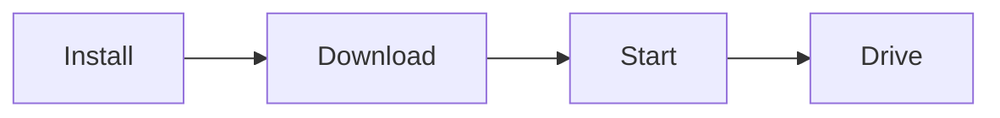

# Quickstart

From zero to a running Autoware planning simulation in about 10 minutes. No `git clone`, no GPU required.



## Prerequisites

- **Ubuntu 22.04 (Jammy) or 24.04 (Noble)** with `sudo` access
- A web browser — the visualizer runs in it, no display server needed

A GPU is **not** needed for this quickstart. For GPU-accelerated deployments and tested machines, see the full [hardware requirements](../platforms/hardware/index.md).

## 1. Install Dependencies

The included `install.sh` sets up Docker Engine and the NVIDIA Container Toolkit in one step:

```bash
{{ install_command }}
```

!!! tip "Skip NVIDIA Toolkit"
    Append `-s -- --no-nvidia` (i.e. `… | sudo bash -s -- --no-nvidia`) if you do not have an NVIDIA GPU. The toolkit is only needed for GPU-accelerated deployments.

Confirm the environment is ready:

```bash
docker compose version
```

## 2. Download the Planning Simulation

```bash
curl -fL https://github.com/autowarefoundation/openadkit/releases/latest/download/planning-simulation.tar.gz | tar xz
cd planning-simulation
```

--8<-- "includes/first-release-note.md"

Then fetch the demo map:

```bash
./install.sh sample-data planning-simulation
```

## 3. Start It

```bash
docker compose --env-file planning-simulation.env up -d
```

Wait about 10 seconds for the containers to initialize.

--8<-- "includes/visualizer-remote-access.md"

## 4. Drive

In RViz2, follow the [Autoware planning simulation instructions](https://autowarefoundation.github.io/autoware-documentation/main/demos/planning-sim/lane-driving/#2-set-an-initial-pose-for-the-ego-vehicle) to:

1. Set an **initial pose** for the ego vehicle
2. Set a **goal pose** on the map
3. Watch the vehicle plan and drive the route

That's it — you are running Autoware. The full guide with configuration, architecture, and cloned-repo usage is at [Planning Simulation](../deployment/planning-simulation/index.md).

If something goes wrong, see [Troubleshooting](troubleshooting.md).

## Next Steps

**[Explore the other deployments](../deployment/index.md)** — scenario testing, rosbag replay, closed-loop CARLA, and distributed cloud-edge operation with Zenoh.

- [Components](../components/index.md) — The architecture behind what you just ran
- [Container Images & Versioning](container-images.md) — Tag schema and pinning guidance
- [Custom Deployment](../deployment/custom-deployment.md) — Compose your own stack
