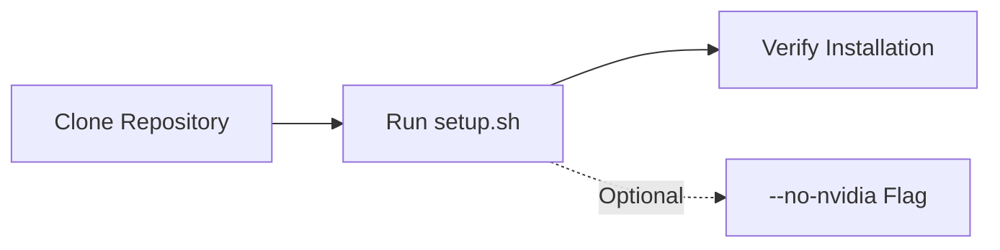

# Getting Started

This guide walks you through setting up your environment and running your first Open AD Kit deployment.

## Prerequisites

Open AD Kit runs on **Ubuntu** with Docker. Install everything with the included [`setup.sh`](https://github.com/autowarefoundation/openadkit/blob/main/setup.sh) script instead of following separate install guides:

| Component | When you need it | How to install |
|-----------|------------------|----------------|
| **Docker Engine** | All deployments | `sudo ./setup.sh` |
| **NVIDIA Container Toolkit** | GPU-accelerated sensing and perception | Included by default; use `--no-nvidia` to skip |
| **Autoware artifacts** | Sensing and perception samples (for example, [Logging Simulation](../deployment/samples/logging-simulation/index.md)) | `sudo ./setup.sh --download-artifacts` |

## Installation

<div class="oak-steps">

- **Clone the repository**
  ```bash
  git clone https://github.com/autowarefoundation/openadkit
  cd openadkit
  ```

- **Set up the runtime environment**
  ```bash
  sudo ./setup.sh
  ```
  This installs Docker, NVIDIA Container Toolkit, and other dependencies. It requires sudo privileges.

  !!! tip "Skip NVIDIA Toolkit"
      Use the `--no-nvidia` flag if you do not have an NVIDIA GPU. Otherwise, the toolkit is **highly recommended** for sensing and perception performance.

- **Download Autoware artifacts (if needed)**
  ```bash
  sudo ./setup.sh --download-artifacts
  ```
  Required for deployments that mount `${HOME}/autoware_data`, including the Logging Simulation sample.

</div>

## Verify Your Installation

After running `setup.sh`, confirm your environment is ready:

```bash
# Check Docker
docker --version
docker compose version

# Check NVIDIA toolkit (if installed)
nvidia-ctk --version

# Verify artifacts directory
ls -la ~/autoware_data
```

!!! success "Ready to Deploy"
    If all checks pass, you are ready to run a sample deployment. See [Sample Deployments](../deployment/samples/index.md).

## Reference

- [Container Image Tags](image-tags.md) — Understanding the tag schema for choosing the right image
- [Release Flow](release-flow.md) — How Open AD Kit releases are built, scanned, and promoted

## Next Steps

- [Run your first deployment](../deployment/samples/planning-simulation/index.md) — Start with the Planning Simulation sample
- [Learn about components](../components/index.md) — Understand the Open AD Kit architecture
- [Choose a platform](../platforms/index.md) — Deploy to AutoSD, EWAOL, or your local machine


