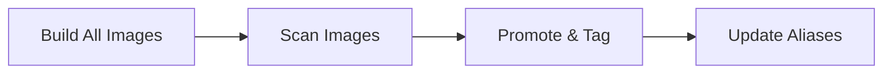

# Release Flow

Open AD Kit releases are promoted from existing CI builds rather than rebuilt at release time. This ensures that the exact images validated during CI are the images that ship to users.

Published release details are listed on the [Releases](../releases/index.md) page.

## Release Process

- **Build all images**
  Run `build-all-images` from `main`. Stable releases must use an Autoware `X.Y.Z` tag; pre-releases may use an Autoware tag or full 40-character SHA.

- **Record the build tag**
  Keep the build summary's `build_tag`, formatted as `RUN_ID-RUN_ATTEMPT`.

- **Scan the images**
  Ensure `scan-images` completes successfully for that `build_tag`. Scheduled builds request scans automatically; otherwise run `scan-images` manually.
  Scans check images for known CVEs.

- **Promote and tag**
  Run the `release` workflow with the Open AD Kit `version` and the validated `build_tag`. This promotes the scanned images to stable release tags and updates latest aliases.

## Source of Truth

The following artifacts are the canonical reference for release validation:

- **Build metadata** — CI run logs and artifact manifests
- **Scan metadata** — SBOM and CVE scan results
- **`.github/image-inventory.json`** — Canonical inventory of all published images and their tags

## Tag Promotion

When a release workflow runs, the following tag aliases are updated:

| From | To | Example |
|------|-----|---------|
| Build tag | Stable release | `planning-control-humble-123456789-1` → `planning-control-humble-v2.0.0` |
| Stable release | Latest alias | `planning-control-humble-v2.0.0` → `planning-control-humble` |
| Latest alias | Default alias | `planning-control-humble` → `planning-control` |

!!! info "Pre-Releases"
    Pre-release tags (e.g., `-rc.1`) are published but **do not update** latest stable aliases. This prevents prerelease images from being pulled by default aliases.

## Related

- [Container Image Tags](image-tags.md) — Understanding the tag schema
- [Getting Started](index.md) — Quick start guide
