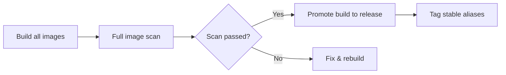

# Release Flow

Open AD Kit releases are **promotions** of existing validated builds, not new builds. This ensures that every released image has passed the full build-and-scan pipeline.

## Release Process

## Step-by-Step

1. **Build**

   Run the `build-all-images` workflow from the `main` branch.

   - Stable Open AD Kit releases must be built from an Autoware `X.Y.Z` tag.
   - Pre-releases may use an Autoware `X.Y.Z` tag or a full 40-character SHA.

2. **Capture the build tag**

   Keep the `build_tag` from the workflow summary. It is formatted as `RUN_ID-RUN_ATTEMPT` (e.g., `123456789-1`).

3. **Scan**

   Ensure `scan-images` completes successfully for that `build_tag`.

   - Scheduled builds request scans automatically.
   - Otherwise, run `scan-images` manually and set `build_tag`.

4. **Release**

   Run the `release` workflow with:

   - Open AD Kit `version` (e.g., `v1.0.0` or `v1.0.0-rc.1`)
   - Validated `build_tag`

## Validation

The release workflow validates:

- The source build succeeded and is from `main`.
- The full scan passed.
- Build metadata, scan metadata, and `.github/image-inventory.json` are consistent.
- Registry digests match between build and scan artifacts.

Only after all checks pass are the stable aliases updated.
