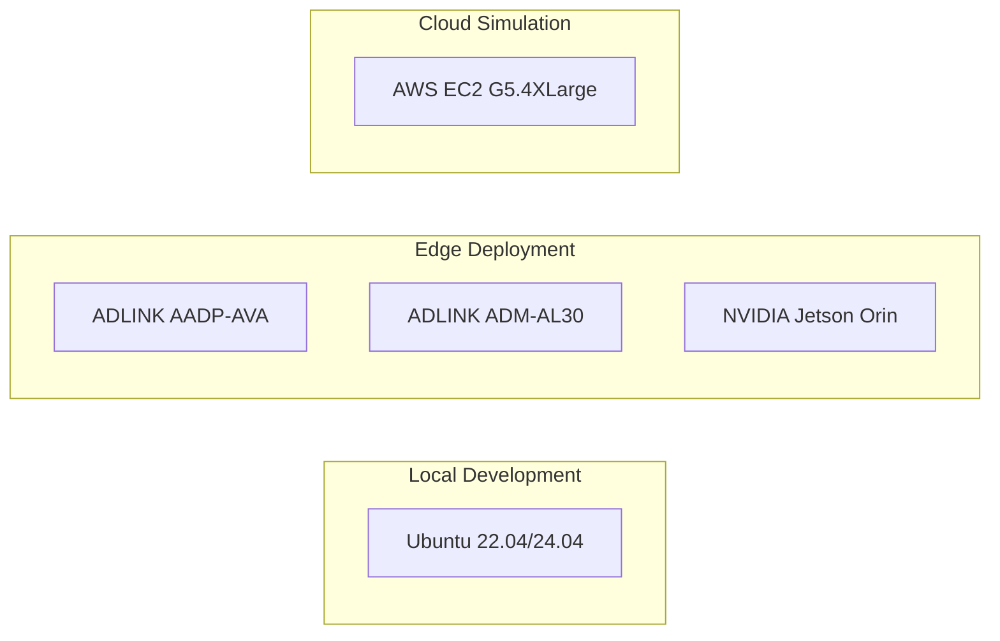

# Hardware

This section provides information about the hardware requirements for Open AD Kit deployments, as well as the tested and planned hardware platforms.

## Requirements

Open AD Kit supports both **amd64** and **arm64** architectures. Requirements vary depending on whether you are running local development/simulation or deploying to a verified edge platform.

### Local Development & Simulation

For running sample deployments, simulations, and development workloads on a workstation or cloud instance:

| Resource | Minimum | Recommended |
|----------|---------|-------------|
| CPU | 8 cores | 16 cores |
| RAM | 16 GB | 32 GB |
| GPU | — | NVIDIA with 4 GB+ VRAM (for sensing/perception) |
| Storage | 50 GB | 100 GB+ SSD |

!!! tip "GPU Recommendation"
    An NVIDIA GPU is highly recommended for sensing and perception tasks. Without a GPU, CUDA-accelerated components will fall back to CPU execution, which significantly impacts performance.

### Verified Edge Deployment

For running a full Autoware stack on a verified edge platform, the requirements are higher:

| Resource | Specification |
|----------|---------------|
| CPU | 40-core Arm Neoverse N1 equivalent (or better) |
| RAM | 32 GB |
| GPU | NVIDIA with CUDA support (for sensing/perception) |
| Architecture | arm64 |

!!! info "Why the difference?"
    The 40-core Neoverse N1 requirement reflects the verified Open AD Kit v3.0 platform (ADLINK AADP-AVA), which runs the full Autoware stack with real-time constraints. Local development with sample simulations has lower requirements.

## Tested Hardware

| Platform | Architecture | Status | Notes |
|----------|--------------|--------|-------|
| ADLINK AADP-AVA | arm64 (Ampere Altra, Neoverse N1) | Verified | Primary verified platform for Open AD Kit v3.0 edge deployment |
| ADLINK ADM-AL30 | arm64 | Verified | Used in Zenoh multi-vehicle fleet management demos |

## Tests Ongoing

| Platform | Architecture | Status | Notes |
|----------|--------------|--------|-------|
| NVIDIA Jetson Orin | arm64 | Tests Ongoing | JetPack 6 validation in progress. Not yet fully verified for production use. |

## Planned Validation

| Platform | Architecture | Status | Notes |
|----------|--------------|--------|-------|
| AWS EC2 G5.4XLarge | amd64 | Planned | GPU-enabled cloud instance for simulation workloads |

## Development Hosts

The following operating systems are supported for local development:

- **Ubuntu 22.04 LTS** (primary)
- **Ubuntu 24.04 LTS**

Other Linux distributions may work but are not actively tested.

## Related

- [Supported Platforms](../platforms/index.md)
- [Getting Started](../getting-started/index.md)

