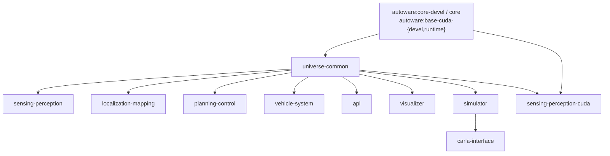

```mermaid
flowchart TB
    UP["autoware:core-devel / core<br/>autoware:base-cuda-{devel,runtime}"] --> UC["universe-common"]
    UC --> SP["sensing-perception"]
    UC --> LM["localization-mapping"]
    UC --> PC["planning-control"]
    UC --> VS["vehicle-system"]
    UC --> API["api"]
    UC --> VIZ["visualizer"]
    UC --> SIM["simulator"]
    UP --> SPC["sensing-perception-cuda"]
    UC --> SPC
    SIM --> CARLA["carla-interface"]
```
