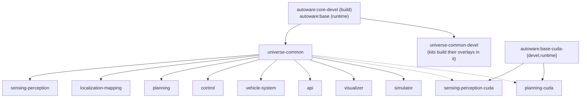

```mermaid
flowchart TB
    CORE["autoware:core-devel (build)<br/>autoware:base (runtime)"] --> UC["universe-common"]
    CORE --> UCD["universe-common-devel<br/>(kits build their overlays in it)"]
    CUDA["autoware:base-cuda-{devel,runtime}"] --> SPC["sensing-perception-cuda"]
    CUDA --> PLC["planning-cuda"]

    UC --> SP["sensing-perception"]
    UC --> LM["localization-mapping"]
    UC --> PLN["planning"]
    UC --> CTL["control"]
    UC --> VS["vehicle-system"]
    UC --> API["api"]
    UC --> VIZ["visualizer"]
    UC --> SIM["simulator"]
    UC -.-> SPC
    UC -.-> PLC
```
