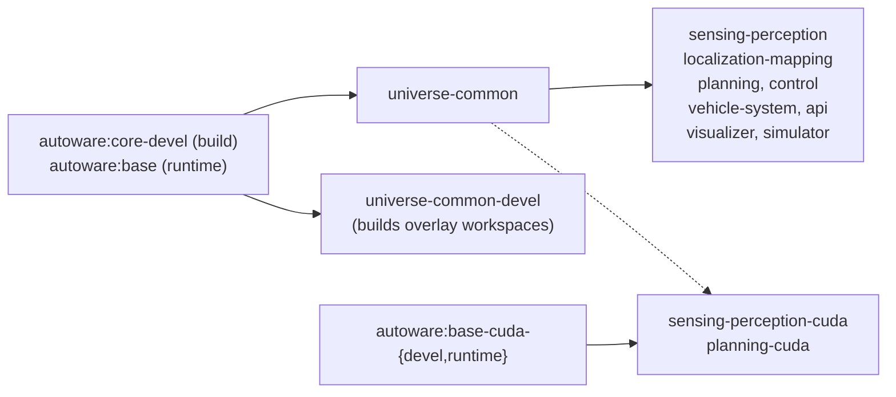

```mermaid
flowchart LR
    CORE["autoware:core-devel (build)<br/>autoware:base (runtime)"] --> UC["universe-common"]
    CORE --> UCD["universe-common-devel<br/>(builds overlay workspaces)"]
    UC --> COMP["sensing-perception<br/>localization-mapping<br/>planning, control<br/>vehicle-system, api<br/>visualizer, simulator"]
    CUDA["autoware:base-cuda-{devel,runtime}"] --> GPU["sensing-perception-cuda<br/>planning-cuda"]
    UC -.-> GPU
```
