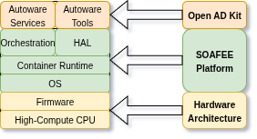

# Introduction

Open AD Kit adopts a modular, service-based architecture designed for flexibility, scalability, and platform independence. It leverages cloud-native principles and containerization to decompose the [Autoware Universe](https://github.com/autowarefoundation/autoware) into a collection of interoperable microservices. This approach allows developers to create customized Autonomous Driving (AD) systems by combining services to meet their specific needs.

## Architecture

The Autoware Foundation is a voting member of the [SOAFEE (Scalable Open Architecture For the Embedded Edge)](https://soafee.io/) initiative, as the Autoware Open AD Kit is the first SOAFEE blueprint for the software defined vehicle ecosystem.

At the heart of the Open AD Kit are two main types of components: **Autoware Services** and **Tools**.

## Core Components

### Autoware Services

The core functional components of the Open AD Kit are derived from the main [Autoware](https://github.com/autowarefoundation/autoware/tree/main/docker) project. Each component is packaged as an independent containerized microservice, responsible for a specific aspect of the autonomous driving pipeline. This granular approach provides flexibility in composing different AD systems.

The primary services include:

- **Sensing**: Collects data from various sensors (Cameras, Lidars, Radars).
- **Perception**: Processes sensor data to detect and track objects in the environment.
- **Mapping**: Creates and maintains maps of the environment.
- **Localization**: Determines the vehicle's position within the map.
- **Planning**: Plans the vehicle's trajectory from its current location to a destination.
- **Control**: Sends commands to the vehicle's actuators to follow the planned trajectory.
- **Vehicle**: Manages the vehicle's internal state and interface.
- **System**: Provides system-level functionalities like health monitoring.
- **API**: Offers an interface for external systems to interact with the vehicle.

These services communicate with each other over a service mesh, allowing for flexible deployment and scaling. For more details on the [Autoware services](./Services/index.md).

### Tools

In addition to the core Autoware services, Open AD Kit provides essential tools for development, simulation, and visualization. These tools are also containerized and can be integrated into deployments as needed.

- **Simulator**: Allows for testing the AD stack in a virtual environment. It supports both simple ad-hoc simulations for development and complex, scenario-based simulations for validation and CI/CD.
- **Visualizer**: Provides a way to inspect the state of the AD system. Using tools like RViz, it can visualize sensor data, perception outputs, planned paths, and more, either locally or remotely through a web browser.

For more details on the [Tools](./Tools/index.md).

### Deployments

A running instance of an Open AD Kit system is referred to as a **Deployment**. A deployment is a specific combination of Autoware services and tools, configured to work together to achieve a particular task, such as a local planning simulation or a full autonomous driving stack for a specific vehicle.

Deployments are defined using container orchestration files (e.g., `docker-compose.yaml`). This makes them portable and easy to reproduce across different environments, from a developer's laptop to edge devices in a vehicle. This container-based approach is a cornerstone of the Open AD Kit's cloud-native and platform-agnostic philosophy, aligning with standards like SOAFEE.

This modular structure allows users to start with a minimal deployment and incrementally add services and tools as their system evolves.

For more details on the [Deployments](./Deployments/index.md).

## Supported Platforms

Open AD Kit supports a variety of platforms as **production** and **development** platforms.

### SOAFEE Production platforms

- [EWAOL](https://ewaol.docs.arm.com/en/kirkstone-dev/)
- [AutoSD](https://docs.centos.org/automotive-sig-documentation/features-and-concepts/)

For more details on the [Supported SOAFEE Platforms](./Platforms/index.md).

### Development platforms

- Ubuntu 22.04, 24.04

## Supported Hardware

### System Requirements

Open AD Kit supports **amd64** and **arm64** architectures with the following requirements:

- CPU with 8 cores
- 16GB RAM
- [Optional] NVIDIA GPU (4GB RAM)

### Tested Proprietary Hardware

- [ADLink AADP-AVA](https://www.adlinktech.com/products/Computer_on_Modules/COM-HPC-Server-Carrier-and-Starter-Kit/Ampere_Altra_Developer_Platform)
- [NVIDIA Jetson Orin](https://www.nvidia.com/en-us/autonomous-machines/embedded-systems/jetson-orin/) (TBD)

### Tested Cloud Hardware

- AWS EC2 G5.4XLarge (TBD)
