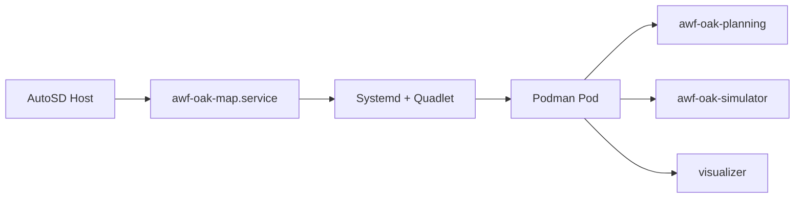

# AutoSD + Planning + Simulator

!!! abstract ""
    This deployment demonstrates how to run and validate Autoware planning and simulation workflows inside AutoSD using systemd-managed containers (Quadlet) and Podman.

## Repository Location

Runnable assets live under [`platforms/autosd/planning-simulator/`](https://github.com/autowarefoundation/openadkit/tree/main/platforms/autosd/planning-simulator) in the Open AD Kit repository.

| Folder | Contents |
|--------|----------|
| `aib/` | Automotive Image Builder manifest files (`image.aib.yml`, `vars.yml`) to build an AutoSD OS image |
| `components/container-files/` | Quadlet unit files for Podman containers and the shared pod |
| `components/systemd/` | systemd oneshot service for map extraction |
| `components/scripts/` | Helper scripts installed into the AutoSD image |

## Prerequisites

Before using this deployment, build and boot an AutoSD image following the [AutoSD Platform Overview](../index.md) guide. You need:

- Docker or Podman and QEMU (for the containerized image builder workflow)
- An RPM-based host if running Automotive Image Builder directly on the host

## Quadlet Services

After boot, systemd starts the following services defined under `components/`:

| Service | Type | Description |
|---------|------|-------------|
| `awf-oak-map.service` | Oneshot | Extracts the bundled Kashiwanoha map to `/opt/tier4/kashiwanoha_map` |
| `awf-oak-planning.container` | Container | Runs the Autoware planning stack with scenario simulation enabled |
| `awf-oak-simulator.container` | Container | Runs the TIER IV Scenario Simulator with the bundled sample scenario |
| `awf-oak.pod` | Pod | Shared Podman pod for co-located planning and simulator containers |

The planning container launches `planning_simulator.launch.xml` with the extracted map mounted at `/etc/awf/map`. The simulator container runs `scenario_test_runner` against the bundled `sample.yaml` scenario.

## Workflow

1. Build an AutoSD image with the Automotive Image Builder using the manifests in `aib/` (see [AutoSD build instructions](../index.md#building-an-autosd-image))
2. Boot the image on QEMU or target hardware
3. Confirm the Quadlet services are active:
   ```bash
   systemctl status awf-oak-map.service
   systemctl status awf-oak-planning.service
   systemctl status awf-oak-simulator.service
   ```
4. Access the visualizer via the exposed noVNC endpoint and run the planning simulation workflow

## Expected Outcome

Once all services are running, you can:

- Set initial and goal poses in the noVNC RViz interface
- Observe the Autoware planning stack responding to the scenario simulator environment
- Validate the AutoSD + Podman + Quadlet deployment path before moving to vehicle hardware

For a Docker Compose equivalent on a development laptop, see the [Planning Simulation sample deployment](../../../deployments/samples/planning-simulation/index.md).

## Related

- [AutoSD Platform Overview](../index.md)
- [Planning Simulation sample deployment](../../../deployments/samples/planning-simulation/index.md)
- [Open AD Kit Deployments](../../../deployments/index.md)
- [Components Overview](../../../components/index.md)


