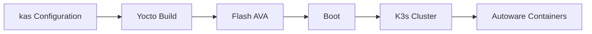

# EWAOL

!!! abstract ""
    EWAOL is a standards-based, container-centric framework for deploying and orchestrating edge workloads. It was the original SOAFEE reference implementation, extending cloud-native methods to automotive with an emphasis on real-time execution and deterministic behavior.

## Status

<span class="oak-badge oak-badge--neutral">Upstream reference</span>

!!! note "Not a committed Open AD Kit target"
    EWAOL is retained as upstream SOAFEE background. Open AD Kit's committed SOAFEE-aligned target is the **Arm Automotive Solutions reference stack / RD-1 AE FVP**. This page documents EWAOL's upstream build/runtime instructions for the ADLINK AADP-AVA platform for reference only; it is not a validated Open AD Kit deployment path.

**This repository:** EWAOL-specific deployment assets and container orchestration files are **not yet present** in this repository.

## What is EWAOL?

EWAOL is delivered via the `meta-ewaol` Yocto layer and organizes the stack into three layers:

1. **User-defined containerized workloads** — Deployed by end users (e.g., Open AD Kit components)
2. **EWAOL Linux filesystem** — Core services including Docker, K3s, and Xen virtualization
3. **Platform-specific system software** — Firmware, bootloader, OS, and optional Xen hypervisor

It provides runtime parity between edge hardware (ADLINK AVA with Ampere Altra / Arm Neoverse N1) and cloud instances (AWS Graviton), making it ideal for hybrid development and deployment workflows.

## Key Capabilities

- **Container-native runtime** with Docker and K3s orchestration
- **Real-time Linux** with deterministic scheduling for time-sensitive workloads
- **Virtualization support** via Xen for mixed-criticality separation
- **Yocto-based build system** using `kas` for reproducible image generation
- **Cloud-to-edge parity** with Arm Neoverse N1 architecture on both AVA and AWS Graviton

## Build Overview

EWAOL images are built with the Yocto [`kas`](https://kas.readthedocs.io/) tool. EWAOL-specific `kas` configuration files are **not yet available in this repository** — they are being added progressively. Once they land, the build will follow the standard `kas` pattern:

```bash
kas build kas/ewaol-ava.yml
```

The build produces a bootable image that can be flashed to the AVA platform. After boot, Autoware components run as containerized workloads under K3s. Until the repository assets land, follow the upstream EWAOL user guide linked below.



## Documentation

For the EWAOL installation and runtime guide, see the upstream documentation:

- [EWAOL User Guide](https://ewaol.docs.arm.com/en/kirkstone-dev/user_guide/reproduce.html)

## Upstream-Documented Platforms

These platforms are documented by the upstream EWAOL project (not validated by Open AD Kit):

| Platform | Architecture | Source |
|----------|--------------|--------|
| ADLINK AADP-AVA | arm64 (Ampere Altra, Neoverse N1) | Upstream EWAOL |
| AWS EC2 Graviton | arm64 (Neoverse N1 equivalent) | Upstream EWAOL |

## Related

- [Supported Platforms overview](../index.md)
- [AutoSD platform](../autosd/index.md)
