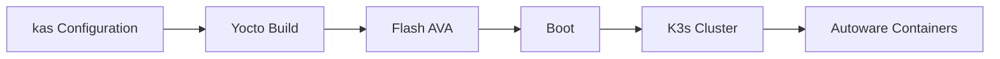

# EWAOL

!!! abstract ""
    EWAOL is a standards-based, container-centric framework for deploying and orchestrating edge workloads. It is the reference implementation for SOAFEE and extends cloud-native methods to automotive with an emphasis on real-time execution and functional safety.

## Status

<span class="oak-badge oak-badge--verified">Verified upstream</span> <span class="oak-badge oak-badge--planned">Assets in progress</span>

EWAOL is a verified platform with upstream build and runtime instructions for the ADLINK AADP-AVA platform.

**Platform status:** Verified upstream (ADLINK AADP-AVA, K3s runtime).

**This repository:** EWAOL-specific deployment assets and container orchestration files are still being added. For current repo status, see [`platforms/README.md`](https://github.com/autowarefoundation/openadkit/blob/main/platforms/README.md).

## What is EWAOL?

EWAOL is delivered via the `meta-ewaol` Yocto layer and organizes the stack into three layers:

1. **User-defined containerized workloads** — Deployed by end users (e.g., Open AD Kit components)
2. **EWAOL Linux filesystem** — Core services including Docker, K3s, and Xen virtualization
3. **Platform-specific system software** — Firmware, bootloader, OS, and optional Xen hypervisor

It provides runtime parity between edge hardware (ADLINK AVA with Ampere Altra / Arm Neoverse N1) and cloud instances (AWS Graviton), making it ideal for hybrid development and deployment workflows.

## Key Capabilities

- **Container-native runtime** with Docker and K3s orchestration
- **Real-time Linux** with deterministic scheduling for safety-critical workloads
- **Virtualization support** via Xen for mixed-criticality separation
- **Yocto-based build system** using `kas` for reproducible image generation
- **Cloud-to-edge parity** with Arm Neoverse N1 architecture on both AVA and AWS Graviton

## Build Overview

The EWAOL build uses `kas` to build Yocto images:

```bash
# Build the image with kas (requires kas configuration files)
kas build kas/ewaol-ava.yml
```

!!! note "Configuration files"
    The `kas/ewaol-ava.yml` configuration file is not yet available in this repository. EWAOL-specific deployment assets are being added progressively.

The build produces a bootable image that can be flashed to the AVA platform. After boot, Autoware components run as containerized workloads under K3s.

## Documentation

For the EWAOL installation and runtime guide, see the upstream documentation:

- [EWAOL User Guide](https://ewaol.docs.arm.com/en/kirkstone-dev/user_guide/reproduce.html)

## Tested Platform

| Platform | Architecture | Status |
|----------|--------------|--------|
| ADLINK AADP-AVA | Arm64 (Ampere Altra, Neoverse N1) | Verified |
| AWS EC2 Graviton | Arm64 (Neoverse N1 equivalent) | Runtime parity confirmed |

## Related

- [Supported Platforms overview](../index.md)
- [AutoSD platform](../autosd/index.md)


