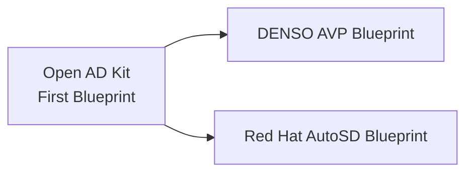

# Supported Platforms

[**Deployments**](../deployment/index.md) provide local development and simulation on Ubuntu using Docker Compose.
**Platforms** provide edge-deployment targets for production automotive operating systems such as AutoSD.

As Open AD Kit is the first [SOAFEE](https://www.soafee.io/) blueprint for the software-defined vehicle ecosystem, it tracks multiple platform directions aligned with cloud-native, software-defined vehicle principles.

!!! abstract "SOAFEE and Open AD Kit"
    The Autoware Foundation is a voting member of [SOAFEE](https://www.soafee.io/) (Scalable Open Architecture For the Embedded Edge). Open AD Kit was co-developed with SOAFEE and the [eSync Alliance](https://esyncalliance.org/) as the first blueprint, and has since seeded derived blueprints including DENSO's AVP blueprint and Red Hat's AutoSD blueprint.

    Read more about the [benefits of open standards in automotive development](https://www.soafee.io/blog/2025/the-benefits-of-open-standards-in-automotive-development/).

## Platform Overview

:material-server:{ .oak-card-icon }

<h3>AutoSD</h3>

Automotive Stream Distribution — the upstream preview of Red Hat In-Vehicle OS. Mixed-criticality containers with Podman, Quadlet, and BlueChi orchestration.

<a href="autosd/" class="md-button md-button--primary">View AutoSD Docs</a>

:material-cloud-outline:{ .oak-card-icon }

<h3>EWAOL</h3>

Edge Workload Abstraction and Orchestration Layer — Arm's container-centric Yocto framework. Upstream SOAFEE reference, retained as background; not a committed Open AD Kit target.

<a href="ewaol/" class="md-button">View EWAOL Docs</a>

## SOAFEE Middleware Platforms

### [AutoSD](autosd/index.md)

Experimental Runnable assets in repo

AutoSD is the upstream binary distribution that serves as the public, in-development preview of **Red Hat In-Vehicle Operating System (OS)**. It is built on CentOS Stream with an automotive-specific kernel (`kernel-automotive`) and provides mixed-criticality container orchestration via Podman, Quadlet, and BlueChi.

Key capabilities:

- **Mixed criticality**: Root partition for safety-critical containers, QM partition for non-critical workloads
- **Atomic updates**: OSTree and composefs for immutable, rollback-capable system images
- **Real-time kernel**: RT-optimized scheduling for deterministic autonomous driving functions
- **Container-native**: Podman and Quadlet for systemd-managed container services

### [EWAOL](ewaol/index.md)

Upstream reference

The Edge Workload Abstraction and Orchestration Layer (EWAOL) is a standards-based, container-centric framework for deploying edge workloads, delivered via the `meta-ewaol` Yocto layer. It was the original SOAFEE reference implementation.

Key capabilities:

- **Container-native runtime**: Docker and K3s orchestration on the edge
- **Real-time Linux**: Deterministic scheduling
- **Virtualization**: Xen support for mixed-criticality separation
- **Cloud-to-edge parity**: Arm Neoverse N1 architecture on both AVA platform and AWS Graviton

!!! note "Not a committed Open AD Kit target"
    EWAOL is retained here as upstream SOAFEE background only. Open AD Kit's committed SOAFEE-aligned target is the **Arm Automotive Solutions reference stack / RD-1 AE FVP** (experimental; SOAFEE Integration Lab validation planned). This page documents EWAOL's upstream build/runtime instructions for reference; it is not a validated Open AD Kit deployment path.

## Development Platforms

For local development and simulation, Open AD Kit supports:

- **Ubuntu 22.04 LTS** (primary)
- **Ubuntu 24.04 LTS**

## Related

- [Hardware requirements and tested platforms](hardware/index.md)
- [Getting started guide](../getting-started/index.md)
