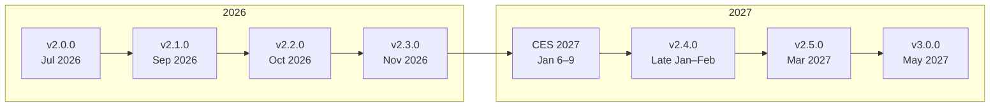

# Roadmap

Open AD Kit releases follow a staged ladder from a **trustworthy release surface**
to an **evidence-backed closed loop**.

## Release ladder

| Release | Target | What it means |
| :--- | :--- | :--- |
| **v2.0.0** | Jul 2026 | First trustworthy release — pinned images, metadata, scans, bundles, docs, compose validation, CARLA 0.9.16. |
| **v2.1.0** | Sep 2026 | Compatibility-set MVP — lockfile, manifests, validation commands, evidence, supported-platform matrix. |
| **v2.2.0** | Oct 2026 | Readiness + test gating — Scenario Simulator V2 CI gate, health-based readiness, one validated restart path. |
| **v2.3.0** | Nov 2026 | Release trust — SBOM, provenance, cosign signing, vulnerability policy, static evidence dashboard. |
| **CES 2027** | Jan 6–9 | Flagship event demo — VisionPilot + Safety Island + CARLA from v2.3 artifacts. Not a release gate. |
| **v2.4.0** | Late Jan–Feb | Platform profiles + ecosystem — AutoSD/Podman, BlueChi first profile, Zenoh split-ready sample, S-Core gap analysis. |
| **v2.5.0** | Mar 2027 | Update/rollback beta — staged apply, health-gated promotion, verified rollback, failure injection. |
| **v3.0.0** | May 2027 | Closed-loop release — build → deploy → test → observe → update → rollback, end-to-end in CI and on a clean host. |

## Status labels

- **`COMMITTED`** — owned and scheduled. Ships executable evidence, or a dated blocker list when blocked by external lab/partner/upstream/hardware access.
- **`CONDITIONAL`** — intended but dependent on validation/access/upstream/hardware/proof. Droppable without blocking core releases.
- **`FUTURE`** — named direction, not scheduled this window.
